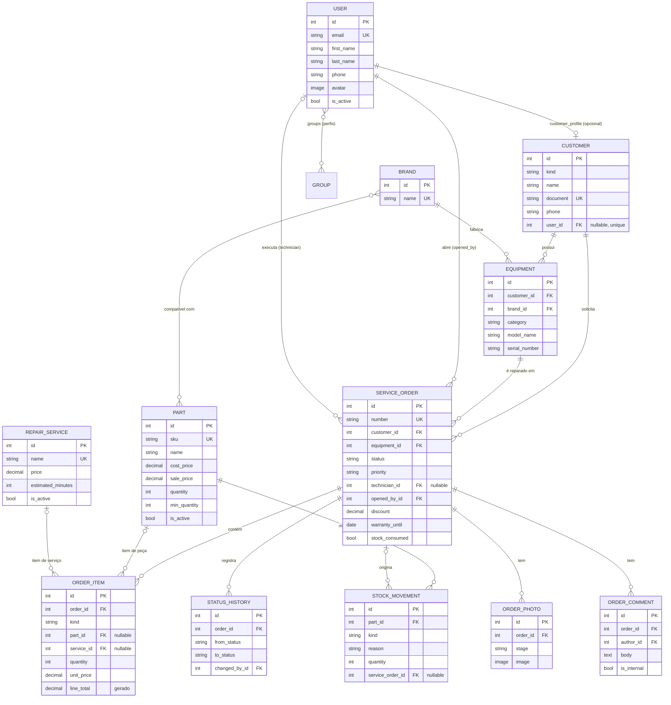
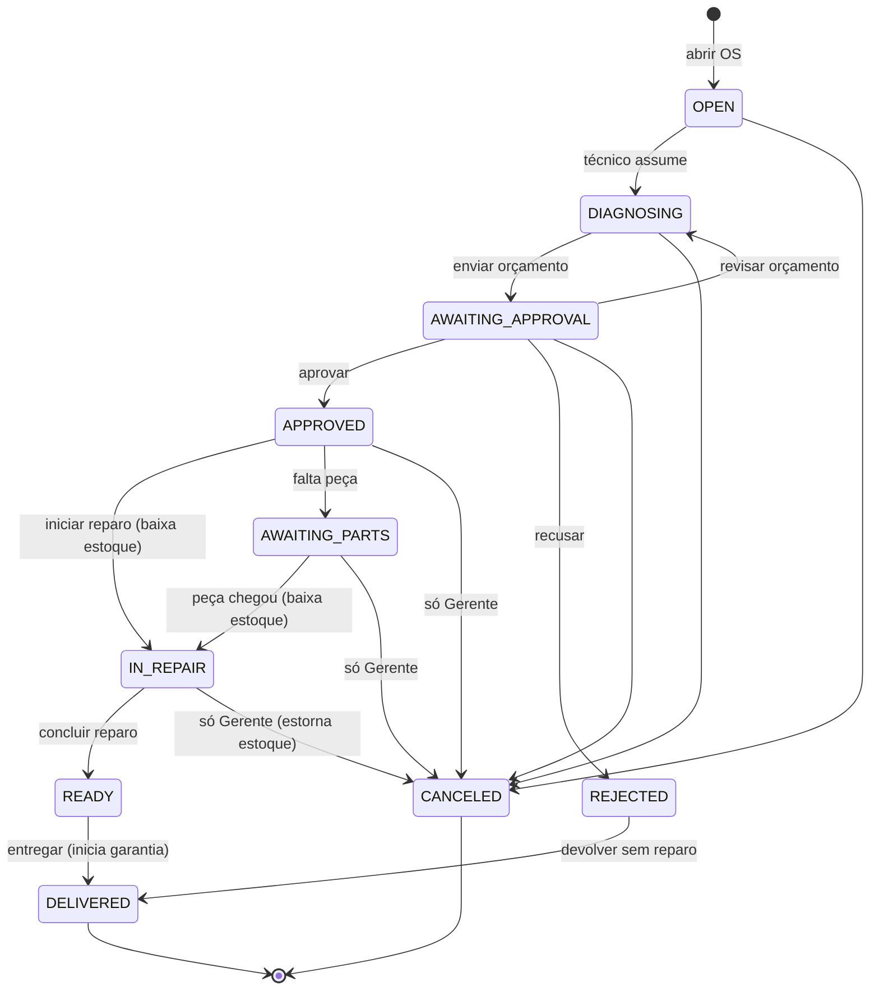

# PRD — OrdemCerta

> **Documento de Requisitos do Produto (PRD)**: o documento que descreve *o que* será construído, *para quem*, *por quê* e *em que ordem*. É a referência única da equipe: em caso de dúvida, o PRD vale.

| Item | Valor |
|---|---|
| Produto | OrdemCerta: gestão de ordens de serviço para assistência técnica |
| Versão do documento | 1.0 |
| Data | 05/10/2026 |
| Autor | Product Owner / Tech Lead (simulado) |
| Desenvolvedor backend | Dev júnior (você) |
| Stack | Python 3.12 · Django 5.2 LTS · SQLite · Django Templates · Tailwind CSS v4 (CLI standalone) |
| Repositório | GitHub, **público**, branch `main` protegida |

---

## Sumário

0. [Decisões e ressalvas sobre os requisitos](#0-decisões-e-ressalvas-sobre-os-requisitos)
1. [Visão geral](#1-visão-geral)
2. [Perfis de usuário e permissões](#2-perfis-de-usuário-e-permissões)
3. [Escopo](#3-escopo)
4. [Modelagem de dados](#4-modelagem-de-dados)
5. [Regras de negócio e máquina de estados da OS](#5-regras-de-negócio-e-máquina-de-estados-da-os)
6. [Arquitetura, camadas e convenções](#6-arquitetura-camadas-e-convenções)
7. [Mapa de URLs e telas](#7-mapa-de-urls-e-telas)
8. [Estrutura de pastas](#8-estrutura-de-pastas)
9. [Stack, dependências e ambiente](#9-stack-dependências-e-ambiente)
10. [Design system](#10-design-system)
11. [Requisitos não funcionais](#11-requisitos-não-funcionais)
12. [Fluxo de trabalho Git e GitHub](#12-fluxo-de-trabalho-git-e-github)
13. [Dinâmica das etapas e papéis](#13-dinâmica-das-etapas-e-papéis)
14. [Plano de etapas (sprints)](#14-plano-de-etapas-sprints)
15. [Rubrica de avaliação](#15-rubrica-de-avaliação)
16. [Glossário](#16-glossário)

---

## 0. Decisões e ressalvas sobre os requisitos

Pontos do pedido original que eram contraditórios, inviáveis ou ambíguos, e como foram resolvidos:

| # | Ponto | Problema | Decisão |
|---|---|---|---|
| 1 | "Django 5.x, última LTS ou estável" | A última estável é a 6.x, que não é 5.x | **Django 5.2 LTS** (suporte até abril de 2028), confirmado pelo dev |
| 2 | Branch principal protegida | No GitHub Free, só funciona em repositório público | **Repositório público**, confirmado pelo dev |
| 3 | PR com revisão obrigatória | Num repositório de uma pessoa só, ninguém pode aprovar o próprio PR | A regra exige **PR + CI verde**, com **0 aprovações**. A revisão é feita pelo Code Reviewer simulado, registrada em `docs/reviews/` |
| 4 | Concorrência no estoque | O SQLite **ignora** `select_for_update()` | Baixa de estoque com `transaction.atomic()` + expressões `F()` + validação. O SQLite serializa escritas, o que basta para este projeto. Fica documentado como limitação |
| 5 | Upload de fotos de OS | Arquivos em `/media/` são acessíveis por quem souber a URL | Nomes de arquivo com UUID (impossíveis de adivinhar). Mídia protegida por permissão fica **fora do escopo** e é registrada como limitação conhecida |
| 6 | `check --deploy` sem alertas | Só faz sentido com as settings de produção | O CI roda `check --deploy` com `config.settings.prod` e variáveis fictícias a partir da Sprint 6 |
| 7 | Seed com Faker | Faker é dependência de desenvolvimento | O comando `seed_data` importa o Faker **dentro** do método `handle`. Assim o projeto funciona sem ele em produção |

---

## 1. Visão geral

### 1.1 Problema

Pequenas assistências técnicas de eletrônicos (celulares, notebooks, consoles) controlam as ordens de serviço em papel, planilhas ou grupos de WhatsApp. As consequências:

- Equipamentos "somem" no fluxo, e ninguém sabe em que etapa está cada um.
- Orçamentos são aprovados por telefone sem registro, o que gera disputa com o cliente.
- O estoque de peças não bate: a peça é usada e ninguém dá baixa.
- O cliente liga várias vezes para perguntar "está pronto?".
- O dono não sabe quanto faturou, qual técnico produz mais nem quais peças mais saem.

### 1.2 Solução

O **OrdemCerta** é um sistema web interno (com uma área para o cliente) que:

1. Cadastra **clientes** e seus **equipamentos**.
2. Abre **ordens de serviço (OS)** com número sequencial, defeito relatado e fotos de entrada.
3. Controla o **ciclo de vida da OS** por uma máquina de estados com regras claras de quem pode fazer o quê.
4. Monta o **orçamento** com peças do estoque e serviços do catálogo, e permite ao cliente **aprovar ou recusar** pelo sistema.
5. Dá **baixa automática no estoque** quando o reparo começa, e estorna se a OS for cancelada.
6. Mantém **histórico** de cada mudança de status, **comentários** internos e públicos e **fotos** de entrada e saída.
7. Notifica o cliente por **e-mail** nos momentos importantes.
8. Oferece **painéis e relatórios** por perfil.

### 1.3 Público-alvo

- **Gerente/dono** da assistência: visão do negócio, configurações e equipe.
- **Atendentes de balcão:** recebem equipamentos e entregam.
- **Técnicos:** fazem diagnóstico e reparo.
- **Clientes finais:** acompanham e aprovam orçamentos.

### 1.4 Objetivo pedagógico (interno da equipe)

Levar o dev júnior a praticar, num sistema com cara de produto real:

- arquitetura por apps;
- Custom User Model;
- permissões e grupos;
- camada de serviços;
- máquina de estados;
- transações;
- uploads;
- formsets;
- agregações;
- testes;
- Docker, CI e disciplina de Git.

---

## 2. Perfis de usuário e permissões

Os perfis são implementados como **Grupos** nativos do Django (`django.contrib.auth.models.Group`), criados pelo comando idempotente `setup_roles` (Sprint 3).

> **Idempotente:** pode ser executado várias vezes sem efeito colateral. Na segunda execução, nada muda.

| Perfil (grupo) | Quem é | Resumo do acesso |
|---|---|---|
| **Gerente** | Dono/gerente | Tudo: cadastros, estoque, catálogo, equipe, relatórios, desconto, cancelamento em qualquer fase |
| **Atendente** | Balcão | Clientes, equipamentos, abertura de OS, registro de aprovação/recusa por telefone, entrega, cancelamento antes da aprovação |
| **Técnico** | Bancada | Assume OS, faz diagnóstico, monta orçamento, executa reparo, envia fotos; vê só as OS atribuídas a ele e as abertas sem técnico |
| **Cliente** | Cliente final | Vê **somente as próprias OS**, aprova/recusa orçamento, comenta, vê fotos |
| *(superusuário)* | Administrador técnico | Acesso total, inclusive ao Django Admin. Não é um perfil de negócio |

### 2.1 Permissões customizadas

Declaradas em `ServiceOrder.Meta.permissions`:

| Codename | Descrição |
|---|---|
| `view_all_serviceorders` | Pode ver todas as OS (não só as próprias) |
| `work_on_serviceorder` | Pode assumir, diagnosticar e reparar OS |
| `assign_technician` | Pode atribuir/trocar o técnico de uma OS |
| `apply_discount` | Pode aplicar desconto no orçamento |
| `cancel_serviceorder` | Pode cancelar OS |
| `deliver_serviceorder` | Pode registrar a entrega ao cliente |
| `view_reports` | Pode acessar relatórios gerenciais |

### 2.2 Matriz de permissões por grupo

Legenda: **V** = view, **A** = add, **C** = change, **D** = delete (permissões padrão do Django), ✔ = permissão customizada concedida.

| Model / permissão | Gerente | Atendente | Técnico | Cliente |
|---|---|---|---|---|
| `accounts.User` | V A C | — | — | — |
| `customers.Customer` | V A C D | V A C | V | — |
| `equipment.Brand` | V A C D | V A | V | — |
| `equipment.Equipment` | V A C D | V A C | V | — |
| `catalog.RepairService` | V A C D | V | V | — |
| `inventory.Part` | V A C D | V | V | — |
| `inventory.StockMovement` | V A | — | V | — |
| `orders.ServiceOrder` | V A C D | V A C | V C | — |
| `orders.OrderItem` | V A C D | V | V A C D | — |
| `orders.OrderPhoto` | V A D | V A D | V A D | — |
| `orders.OrderComment` | V A | V A | V A | — |
| `view_all_serviceorders` | ✔ | ✔ | — | — |
| `work_on_serviceorder` | ✔ | — | ✔ | — |
| `assign_technician` | ✔ | ✔ | — | — |
| `apply_discount` | ✔ | — | — | — |
| `cancel_serviceorder` | ✔ | ✔ | — | — |
| `deliver_serviceorder` | ✔ | ✔ | — | — |
| `view_reports` | ✔ | — | — | — |

**Regras que não cabem em "permissão de model"** e são verificadas por **posse do objeto** (ownership) na camada de serviço ou no queryset:

- O **Cliente** não tem nenhuma permissão de model. Ele acessa apenas OS cujo `customer.user` é ele mesmo, verificado via queryset (`visible_to`).
- O **Técnico** só altera itens e status de OS em que ele é o `technician` (ou de OS abertas sem técnico, ao assumi-las).
- O **Atendente** cancela apenas OS em `ABERTA`, `EM_DIAGNOSTICO` ou `AGUARDANDO_APROVACAO`. A partir de `APROVADA`, só o **Gerente** cancela.
- Ninguém exclui usuários: a equipe é **desativada** (`is_active = False`).
- `StockMovement` é **imutável**: não existe editar nem excluir, nem no admin.

---

## 3. Escopo

### 3.1 Dentro do escopo

- Cadastro com login por e-mail, login, logout, perfil com avatar, troca e recuperação de senha (e-mail no console em desenvolvimento).
- Autocadastro de **cliente**, com vínculo automático a um cadastro de cliente já existente pelo CPF/CNPJ.
- Gestão da **equipe** pelo Gerente (criar, editar papel, desativar).
- CRUD de **clientes** (PF/PJ, validação de CPF/CNPJ), **marcas**, **equipamentos**, **serviços do catálogo** e **peças**.
- **Movimentações de estoque** (entrada, saída, ajuste) com histórico imutável e alerta de estoque mínimo.
- **Ordens de serviço:** abertura com fotos de entrada, atribuição de técnico, orçamento com itens, desconto, máquina de estados, histórico, comentários internos e públicos, fotos de diagnóstico e saída, impressão do comprovante.
- **Área do cliente:** minhas OS, aprovar/recusar orçamento, comentar.
- **Acompanhamento público** de OS por número + documento, sem login.
- **E-mails** transacionais em mudanças de status relevantes.
- **Painéis por perfil**, **relatórios gerenciais** e **exportação CSV**.
- Busca, filtros e paginação em todas as listagens.
- Django Admin customizado para todos os models.
- Comandos `setup_roles` e `seed_data`.
- Testes, lint, Docker para desenvolvimento, CI, settings separadas por ambiente, logging, páginas de erro.

### 3.2 Fora do escopo

| Item | Motivo |
|---|---|
| API REST / DRF | Projeto full stack com templates; você já praticou DRF no projeto anterior |
| Pagamentos, financeiro, nota fiscal | Complexidade de domínio fora do objetivo |
| Várias lojas (multi-tenant) | Aumentaria muito a modelagem |
| Agenda de técnicos, SLA por contrato | Escopo futuro |
| WhatsApp, SMS, push, chat em tempo real (WebSockets) | Exigiriam serviços externos ou infraestrutura extra |
| Geração de PDF | Substituída por **página de impressão** com CSS de impressão |
| Reabertura de OS em garantia | Escopo futuro (a data de garantia é registrada) |
| Mídia protegida por permissão | Ver ressalva 5 na seção 0 |
| Limite de requisições (rate limiting) | Exigiria dependência ou cache. Registrado como melhoria futura |
| Deploy real em servidor | Entregamos settings de produção prontas e `check --deploy` limpo; não publicamos |
| PostgreSQL, Celery, Redis | Requisito: só SQLite e recursos nativos |
| Testes E2E com Selenium | Já praticados; o foco agora é teste de unidade e integração com o test client do Django |
| Multi-idioma | Apenas pt-BR |

---

## 4. Modelagem de dados

### 4.1 Convenções gerais

- **Todo model** herda de `core.models.TimeStampedModel`, um model **abstrato** (não gera tabela própria) com `created_at` (`auto_now_add=True`) e `updated_at` (`auto_now=True`).
- Nomes de classes, campos e código em **inglês**. `verbose_name`, `verbose_name_plural`, `help_text`, labels e mensagens em **pt-BR**.
- Todo model tem `__str__`, `Meta.verbose_name`, `Meta.verbose_name_plural` e `Meta.ordering`. Também tem `get_absolute_url` quando tiver página de detalhe.
- Escolhas fixas usam `models.TextChoices`.
- Dinheiro usa `DecimalField(max_digits=10, decimal_places=2)`. **Nunca** `FloatField`.
- Regras de integridade que o banco consegue garantir viram **constraints** (`CheckConstraint`, `UniqueConstraint`), além da validação no form/model.
  - No Django 5.2, o argumento do `CheckConstraint` é `condition=` (o antigo `check=` está obsoleto).
- Chaves estrangeiras usam `on_delete=PROTECT` quando apagar o "pai" destruiria histórico de negócio.
- Documentos (CPF/CNPJ), CEP e telefones são guardados **só com dígitos**. A formatação é papel da apresentação.

### 4.2 Apps e models

#### `core`: código compartilhado (sem tabelas próprias)

**`TimeStampedModel`** (abstrato)

| Campo | Tipo | Restrições |
|---|---|---|
| `created_at` | `DateTimeField` | `auto_now_add=True`, `verbose_name="criado em"` |
| `updated_at` | `DateTimeField` | `auto_now=True`, `verbose_name="atualizado em"` |

Também em `core`, sem models:

- **`validators.py`:**
  - `validate_cpf`, `validate_cnpj`, `validate_cpf_cnpj` (dígitos verificadores);
  - `validate_phone`;
  - `MaxFileSizeValidator`, uma classe com `@deconstructible` para poder ser usada em migrations.
- **`mixins.py`:**
  - `PageTitleMixin`;
  - `SearchMixin`;
  - `FilterFormMixin`;
  - `ProtectedDeleteMixin`;
  - `RoleRequiredMixin`.
- **`exceptions.py`:** `BusinessRuleError`, a base de todas as exceções de regra de negócio.
- **`context_processors.py`:** `navigation`, que expõe `nav_items` e `user_role`.
- **`utils.py`:** `only_digits`, `delete_file_if_exists`.
- **`management/commands/`:** `setup_roles`, `seed_data`.
- **`templatetags/`:** tags de apresentação, de responsabilidade do Especialista Frontend.

#### `accounts`: usuários e autenticação

**`User`** (`AbstractUser` + `TimeStampedModel`)

| Campo | Tipo | Restrições |
|---|---|---|
| `username` | — | **removido** (`username = None`) |
| `email` | `EmailField` | `unique=True`, obrigatório, `verbose_name="e-mail"` |
| `first_name` | `CharField(150)` | obrigatório (validado nos forms) |
| `last_name` | `CharField(150)` | obrigatório (validado nos forms) |
| `phone` | `CharField(11)` | `blank=True`, `validate_phone`, só dígitos |
| `avatar` | `ImageField` | `upload_to="avatars/%Y/%m/"`, `blank=True`, máx. 2 MB, extensões jpg/jpeg/png/webp |
| *(herdados)* | | `password`, `is_active`, `is_staff`, `is_superuser`, `last_login`, `date_joined`, `groups`, `user_permissions` |

- `USERNAME_FIELD = "email"`, `REQUIRED_FIELDS = ["first_name", "last_name"]`.
- `objects = UserManager()`, um manager customizado que herda de `BaseUserManager`:
  - `create_user` exige e-mail e o normaliza;
  - `create_superuser` força `is_staff` e `is_superuser`.
- Propriedades: `full_name`, `role` (nome do grupo de perfil ou `None`), `is_manager`, `is_attendant`, `is_technician`, `is_customer`.
- `Meta.ordering = ["first_name", "last_name"]`.

**`Role`** (`TextChoices` em `accounts/roles.py`, não é model): `MANAGER="Gerente"`, `ATTENDANT="Atendente"`, `TECHNICIAN="Técnico"`, `CUSTOMER="Cliente"`. Os valores são os nomes dos grupos.

#### `customers`: clientes

**`Customer`**

| Campo | Tipo | Restrições |
|---|---|---|
| `kind` | `CharField(2)` | choices `Kind`: `PF` "Pessoa física", `PJ` "Pessoa jurídica"; default `PF` |
| `name` | `CharField(150)` | obrigatório; nome ou razão social |
| `document` | `CharField(14)` | `unique=True`, `validate_cpf_cnpj`, só dígitos |
| `email` | `EmailField` | `blank=True` |
| `phone` | `CharField(11)` | obrigatório, `validate_phone` |
| `zip_code` | `CharField(8)` | `blank=True` |
| `street` | `CharField(150)` | `blank=True` |
| `number` | `CharField(10)` | `blank=True` |
| `complement` | `CharField(60)` | `blank=True` |
| `district` | `CharField(80)` | `blank=True` |
| `city` | `CharField(80)` | `blank=True` |
| `state` | `CharField(2)` | choices `UF` (27 UFs), `blank=True` |
| `notes` | `TextField` | `blank=True` |
| `user` | `OneToOneField(User)` | `null=True`, `blank=True`, `on_delete=SET_NULL`, `related_name="customer_profile"` |
| `created_by` | `ForeignKey(User)` | `null=True`, `on_delete=SET_NULL`, `related_name="+"` |

- `clean()`: PF exige 11 dígitos e PJ exige 14, coerentes com `kind`.
- `CustomerQuerySet.search(term)`: busca em nome, documento, e-mail e telefone.
- `Meta.ordering = ["name"]`, índice em `name`.

#### `equipment`: marcas e equipamentos

**`Brand`**

| Campo | Tipo | Restrições |
|---|---|---|
| `name` | `CharField(60)` | `UniqueConstraint(Lower("name"))`, único sem diferenciar maiúsculas |

**`Equipment`**

| Campo | Tipo | Restrições |
|---|---|---|
| `customer` | `ForeignKey(Customer)` | `on_delete=PROTECT`, `related_name="equipments"` |
| `category` | `CharField(20)` | choices `Category`: `SMARTPHONE`, `TABLET`, `NOTEBOOK`, `DESKTOP`, `CONSOLE`, `OTHER` |
| `brand` | `ForeignKey(Brand)` | `on_delete=PROTECT`, `related_name="equipments"` |
| `model_name` | `CharField(100)` | obrigatório (ex.: "Galaxy S21") |
| `serial_number` | `CharField(100)` | `blank=True` (número de série ou IMEI) |
| `color` | `CharField(40)` | `blank=True` |
| `notes` | `TextField` | `blank=True` |

- `UniqueConstraint(fields=["brand", "serial_number"], condition=~Q(serial_number=""))`: um **unique condicional**, que só vale quando o número de série é preenchido.
- `__str__`: "Samsung Galaxy S21 (SN 123…)".

#### `catalog`: serviços (mão de obra)

**`RepairService`**

| Campo | Tipo | Restrições |
|---|---|---|
| `name` | `CharField(120)` | `unique=True` |
| `description` | `TextField` | `blank=True` |
| `price` | `DecimalField(10,2)` | `CheckConstraint price >= 0` |
| `estimated_minutes` | `PositiveIntegerField` | `> 0` |
| `is_active` | `BooleanField` | default `True` |

- `RepairServiceQuerySet.active()`.

#### `inventory`: peças e estoque

**`Part`**

| Campo | Tipo | Restrições |
|---|---|---|
| `sku` | `CharField(30)` | `unique=True`; código interno |
| `name` | `CharField(120)` | obrigatório |
| `description` | `TextField` | `blank=True` |
| `compatible_brands` | `ManyToManyField(Brand)` | `blank=True`, `related_name="parts"` |
| `cost_price` | `DecimalField(10,2)` | `>= 0` |
| `sale_price` | `DecimalField(10,2)` | `CheckConstraint sale_price >= cost_price` |
| `quantity` | `PositiveIntegerField` | default 0. **Nunca editado por form**: muda só por movimentação |
| `min_quantity` | `PositiveIntegerField` | default 1 |
| `photo` | `ImageField` | `upload_to="parts/%Y/%m/"`, `blank=True`, máx. 2 MB |
| `is_active` | `BooleanField` | default `True` |

- `PartQuerySet`: `active()`, `low_stock()` (`quantity <= min_quantity`, usando `F()`) e `search(term)`.
- Propriedade `is_low_stock`.

**`StockMovement`** (imutável)

| Campo | Tipo | Restrições |
|---|---|---|
| `part` | `ForeignKey(Part)` | `on_delete=PROTECT`, `related_name="movements"` |
| `kind` | `CharField(3)` | choices `Kind`: `IN` "Entrada", `OUT` "Saída" |
| `reason` | `CharField(20)` | choices `Reason`: `PURCHASE` "Compra", `ORDER_USE` "Uso em OS", `ORDER_RETURN` "Estorno de OS", `ADJUSTMENT` "Ajuste de inventário", `LOSS` "Perda/avaria" |
| `quantity` | `PositiveIntegerField` | `CheckConstraint quantity > 0` |
| `service_order` | `ForeignKey("orders.ServiceOrder")` | `null=True`, `blank=True`, `on_delete=PROTECT`, `related_name="stock_movements"` |
| `note` | `CharField(200)` | `blank=True` |
| `created_by` | `ForeignKey(User)` | `null=True`, `on_delete=SET_NULL` |

- `Meta.ordering = ["-created_at"]`.
- Coerência entre `kind` e `reason`, validada no serviço: `PURCHASE` e `ORDER_RETURN` só em `IN`; `ORDER_USE` e `LOSS` só em `OUT`; `ADJUSTMENT` em ambos.

#### `orders`: ordens de serviço

**`ServiceOrder`**

| Campo | Tipo | Restrições |
|---|---|---|
| `number` | `CharField(20)` | `unique=True`, `editable=False`; formato `OS-AAAA-NNNNN` (sequência reinicia a cada ano) |
| `customer` | `ForeignKey(Customer)` | `on_delete=PROTECT`, `related_name="orders"` |
| `equipment` | `ForeignKey(Equipment)` | `on_delete=PROTECT`, `related_name="orders"` |
| `status` | `CharField(30)` | choices `Status` (seção 5), default `OPEN`, `db_index=True` |
| `priority` | `CharField(10)` | choices `Priority`: `LOW`, `NORMAL`, `HIGH`, `URGENT`; default `NORMAL` |
| `reported_problem` | `TextField` | obrigatório (defeito relatado pelo cliente) |
| `accessories` | `CharField(200)` | `blank=True` (ex.: "carregador, capa") |
| `entry_condition` | `TextField` | `blank=True` (estado de conservação na entrada) |
| `diagnosis` | `TextField` | `blank=True` (preenchido pelo técnico) |
| `technician` | `ForeignKey(User)` | `null=True`, `blank=True`, `on_delete=SET_NULL`, `related_name="assigned_orders"`, `limit_choices_to={"groups__name": "Técnico"}` |
| `opened_by` | `ForeignKey(User)` | `on_delete=PROTECT`, `related_name="opened_orders"` |
| `discount` | `DecimalField(10,2)` | default 0; `CheckConstraint discount >= 0` |
| `estimated_delivery` | `DateField` | `null=True`, `blank=True` (previsão de entrega) |
| `estimate_sent_at` | `DateTimeField` | `null=True`, `blank=True` |
| `approved_at` | `DateTimeField` | `null=True`, `blank=True` |
| `rejected_at` | `DateTimeField` | `null=True`, `blank=True` |
| `rejection_reason` | `TextField` | `blank=True` |
| `ready_at` | `DateTimeField` | `null=True`, `blank=True` |
| `delivered_at` | `DateTimeField` | `null=True`, `blank=True` |
| `canceled_at` | `DateTimeField` | `null=True`, `blank=True` |
| `cancel_reason` | `TextField` | `blank=True` |
| `warranty_until` | `DateField` | `null=True`, `blank=True` |
| `stock_consumed` | `BooleanField` | default `False` (indica se já houve baixa de peças) |

- `Meta.ordering = ["-created_at"]`.
- `Meta.permissions`: ver 2.1.
- `Meta.indexes` em `status` e `created_at`.
- `clean()`: `equipment.customer` deve ser igual a `customer`.
- `ServiceOrderQuerySet`:
  - `visible_to(user)`;
  - `open()` (não finais);
  - `overdue()` (`estimated_delivery` < hoje e não final);
  - `with_totals()` (anotações `parts_total`, `services_total`, `subtotal`, `total`);
  - `search(term)` (número, nome e documento do cliente, modelo e série do equipamento).
- Métodos e propriedades: `get_absolute_url` (pelo `number`), `is_final`, `is_overdue`, `can_transition_to(status)`.

**`OrderItem`**

| Campo | Tipo | Restrições |
|---|---|---|
| `order` | `ForeignKey(ServiceOrder)` | `on_delete=CASCADE`, `related_name="items"` |
| `kind` | `CharField(10)` | choices `Kind`: `PART` "Peça", `SERVICE` "Serviço" |
| `part` | `ForeignKey(Part)` | `null=True`, `blank=True`, `on_delete=PROTECT` |
| `service` | `ForeignKey(RepairService)` | `null=True`, `blank=True`, `on_delete=PROTECT` |
| `description` | `CharField(150)` | cópia do nome no momento da inclusão (*snapshot*) |
| `quantity` | `PositiveIntegerField` | default 1; `CheckConstraint quantity >= 1` |
| `unit_price` | `DecimalField(10,2)` | *snapshot* do preço no momento da inclusão |
| `line_total` | `GeneratedField` | expressão `quantity * unit_price`, `DecimalField(12,2)`, `db_persist=True` |

- `CheckConstraint`: se `kind=PART`, então `part` é preenchido e `service` é nulo. Se `kind=SERVICE`, o contrário.
- `UniqueConstraint(fields=["order", "part"], condition=Q(part__isnull=False))`: a mesma peça não se repete. O serviço **soma a quantidade** em vez de duplicar.

**`StatusHistory`**

| Campo | Tipo | Restrições |
|---|---|---|
| `order` | `ForeignKey(ServiceOrder)` | `on_delete=CASCADE`, `related_name="history"` |
| `from_status` | `CharField(30)` | `blank=True` (vazio na abertura) |
| `to_status` | `CharField(30)` | choices `Status` |
| `changed_by` | `ForeignKey(User)` | `null=True`, `on_delete=SET_NULL` |
| `note` | `TextField` | `blank=True` |

- `Meta.ordering = ["created_at"]`.

**`OrderPhoto`**

| Campo | Tipo | Restrições |
|---|---|---|
| `order` | `ForeignKey(ServiceOrder)` | `on_delete=CASCADE`, `related_name="photos"` |
| `stage` | `CharField(10)` | choices `Stage`: `ENTRY` "Entrada", `DIAGNOSIS` "Diagnóstico", `EXIT` "Saída" |
| `image` | `ImageField` | `upload_to=order_photo_upload_to` (`orders/<número>/<uuid>.<ext>`), máx. 5 MB, jpg/jpeg/png/webp |
| `caption` | `CharField(120)` | `blank=True` |
| `uploaded_by` | `ForeignKey(User)` | `null=True`, `on_delete=SET_NULL` |

**`OrderComment`**

| Campo | Tipo | Restrições |
|---|---|---|
| `order` | `ForeignKey(ServiceOrder)` | `on_delete=CASCADE`, `related_name="comments"` |
| `author` | `ForeignKey(User)` | `null=True`, `on_delete=SET_NULL` |
| `body` | `TextField` | obrigatório, 2 a 2000 caracteres |
| `is_internal` | `BooleanField` | default `True`. O cliente só vê `False`, e o comentário do cliente é sempre `False` |

#### `reports`: painéis e relatórios (sem models)

Contém `selectors.py` (consultas agregadas), `forms.py` (filtro de período) e as views de painel, relatório e CSV.

### 4.3 Diagrama entidade-relacionamento



*(Todos os models também têm `created_at` e `updated_at`, omitidos no diagrama.)*

---

## 5. Regras de negócio e máquina de estados da OS

> **Máquina de estados:** um modelo em que o objeto está sempre em **um** estado de um conjunto finito, e só pode mudar de estado por **transições** explicitamente permitidas, cada uma com guardas (pré-condições) e efeitos.

### 5.1 Status

| Valor (`Status`) | Rótulo | Final? |
|---|---|---|
| `OPEN` | Aberta | |
| `DIAGNOSING` | Em diagnóstico | |
| `AWAITING_APPROVAL` | Aguardando aprovação | |
| `APPROVED` | Aprovada | |
| `AWAITING_PARTS` | Aguardando peça | |
| `IN_REPAIR` | Em reparo | |
| `READY` | Pronta para retirada | |
| `DELIVERED` | Entregue | ✔ |
| `REJECTED` | Orçamento recusado | |
| `CANCELED` | Cancelada | ✔ |



### 5.2 Tabela de transições

| # | De → Para | Quem pode | Guardas (pré-condições) | Efeitos |
|---|---|---|---|---|
| T1 | `OPEN` → `DIAGNOSING` | `work_on_serviceorder`; se a OS tem técnico, só ele ou o Gerente | — | Se sem técnico, `technician = usuário` |
| T2 | `DIAGNOSING` → `AWAITING_APPROVAL` | Técnico da OS ou Gerente | `diagnosis` preenchido; ≥ 1 item | `estimate_sent_at = agora`; e-mail "orçamento disponível" |
| T3 | `AWAITING_APPROVAL` → `DIAGNOSING` | Técnico da OS ou Gerente | — | `estimate_sent_at = None` |
| T4 | `AWAITING_APPROVAL` → `APPROVED` | Cliente dono da OS **ou** `change_serviceorder` (Atendente/Gerente registram aprovação por telefone, com nota obrigatória) | — | `approved_at = agora` |
| T5 | `AWAITING_APPROVAL` → `REJECTED` | Igual a T4 | motivo obrigatório | `rejected_at`, `rejection_reason` |
| T6 | `APPROVED` → `IN_REPAIR` | Técnico da OS ou Gerente | estoque suficiente para **todas** as peças | Baixa de estoque (`OUT`/`ORDER_USE`) de cada peça; `stock_consumed = True` |
| T7 | `APPROVED` → `AWAITING_PARTS` | Técnico da OS ou Gerente | ≥ 1 peça com estoque insuficiente | — |
| T8 | `AWAITING_PARTS` → `IN_REPAIR` | Técnico da OS ou Gerente | estoque suficiente | Igual a T6 |
| T9 | `IN_REPAIR` → `READY` | Técnico da OS ou Gerente | ≥ 1 foto de `EXIT` (a partir da Sprint 5) | `ready_at`; e-mail "pronto para retirada" |
| T10 | `READY` → `DELIVERED` | `deliver_serviceorder` | — | `delivered_at`; `warranty_until = hoje + ORDERS_WARRANTY_DAYS` (90); e-mail "entregue" |
| T11 | `REJECTED` → `DELIVERED` | `deliver_serviceorder` | — | `delivered_at`; **sem** garantia |
| T12 | `OPEN`/`DIAGNOSING`/`AWAITING_APPROVAL` → `CANCELED` | `cancel_serviceorder` | motivo obrigatório | `canceled_at`, `cancel_reason` |
| T13 | `APPROVED`/`AWAITING_PARTS`/`IN_REPAIR` → `CANCELED` | `cancel_serviceorder` **e** perfil Gerente | motivo obrigatório | Igual a T12 + estorno (`IN`/`ORDER_RETURN`) se `stock_consumed`; `stock_consumed = False` |

**Toda** transição, sem exceção, cria um `StatusHistory` (de, para, quem, nota).

### 5.3 Demais regras de negócio

| ID | Regra |
|---|---|
| RN01 | O número da OS é gerado pelo sistema no formato `OS-AAAA-NNNNN`. A sequência é por ano, sem buracos por concorrência dentro da transação, e é única |
| RN02 | O equipamento da OS deve pertencer ao cliente da OS |
| RN03 | Itens só podem ser incluídos ou removidos com a OS em `DIAGNOSING`, pelo técnico da OS ou pelo Gerente |
| RN04 | Ao incluir item, `description` e `unit_price` são **copiados** da peça (`sale_price`) ou do serviço (`price`). Mudanças posteriores de preço no cadastro não alteram orçamentos existentes |
| RN05 | Só peças e serviços **ativos** podem ser incluídos |
| RN06 | Incluir uma peça que já está na OS **soma** a quantidade (não duplica a linha) |
| RN07 | Totais: `parts_total` = soma dos `line_total` de peças; `services_total` = soma dos de serviços; `subtotal` = soma dos dois; `total` = `subtotal − discount` |
| RN08 | Desconto: exige `apply_discount`; só em `DIAGNOSING` ou `AWAITING_APPROVAL`; `0 ≤ discount ≤ subtotal` |
| RN09 | O estoque nunca fica negativo. Saída maior que o saldo levanta `InsufficientStockError` e **nada** é gravado (transação) |
| RN10 | `Part.quantity` só muda via `inventory.services` (que cria `StockMovement`). Nunca por form, admin ou atribuição direta |
| RN11 | `StockMovement` não pode ser editado nem excluído |
| RN12 | Peças e serviços do catálogo não são excluídos se já foram usados (`PROTECT`): são **desativados** |
| RN13 | Cliente, equipamento ou marca com OS/equipamentos vinculados não pode ser excluído. A view captura `ProtectedError` e exibe mensagem amigável |
| RN14 | No autocadastro, se já existe `Customer` **sem usuário** com o mesmo documento, o novo usuário é vinculado a ele. Se existe com usuário, o cadastro é recusado ("documento já vinculado a outra conta"). Se não existe, um `Customer` é criado. Em todos os casos o usuário entra no grupo Cliente |
| RN15 | O usuário da equipe criado pelo Gerente recebe exatamente **um** grupo de perfil. Trocar o perfil remove o anterior |
| RN16 | O Cliente vê comentários públicos, fotos e histórico de status, mas **não** vê comentários internos, custo das peças nem quem é o técnico |
| RN17 | Acompanhamento público: exige número da OS **e** documento do cliente. Se qualquer um estiver errado, a resposta é a mesma mensagem genérica ("não encontramos uma OS com esses dados"), para evitar enumeração |
| RN18 | E-mails transacionais só são enviados **após o commit** da transação (`transaction.on_commit`) e só se o cliente tiver e-mail |
| RN19 | Usuário inativo não faz login. Ninguém é excluído; a equipe é desativada |
| RN20 | A garantia (`warranty_until`) só existe para OS entregues após reparo (T10), não para devolução sem reparo (T11) |

---

## 6. Arquitetura, camadas e convenções

### 6.1 Onde fica cada coisa

| Camada | Arquivo | Responsabilidade | Não deve |
|---|---|---|---|
| **Model** | `models.py` | Campos, constraints, `clean()` de invariantes do próprio objeto, propriedades simples, `get_absolute_url` | Enviar e-mail, mexer em outros aggregates, conhecer `request` |
| **QuerySet/Manager** | `querysets.py` (ou dentro de `models.py`, se pequeno) | **Leituras** reutilizáveis: filtros, anotações, visibilidade (`visible_to`) | Gravar dados |
| **Serviço** | `services.py` | **Escritas** com regra de negócio: transições, estoque, numeração, vínculos entre apps. Funções com argumentos nomeados (`*,`), `transaction.atomic`, levantam exceções de domínio | Receber `request`, retornar `HttpResponse`, usar `messages` |
| **Exceções** | `exceptions.py` | Exceções de domínio (herdam de `core.exceptions.BusinessRuleError`) | — |
| **Selectors** | `reports/selectors.py` | Consultas agregadas complexas de leitura (relatórios) | Gravar dados |
| **Form** | `forms.py` | Validação de **entrada** (formato, campos obrigatórios, coerência entre campos do form) | Regra de negócio que dependa do estado do banco além de unicidade simples |
| **View** | `views.py` (ou pacote `views/`) | HTTP: autenticação, permissão, chamar form e serviço, traduzir exceção de domínio em `messages` e redirect, montar o contexto do contrato | Conter regra de negócio, fazer `.save()` de regra complexa, montar HTML |
| **Signals** | `signals.py`, registrados em `apps.py → ready()` | Efeitos **técnicos** colaterais: limpar arquivos órfãos, logar tentativas de login | Regra de negócio (essa fica explícita nos serviços) |
| **Admin** | `admin.py` | Interface administrativa | Contornar regras (ex.: editar `quantity`) |
| **Template** | `templates/` | Apresentação (responsabilidade do Frontend) | Lógica de negócio |

**Regra de ouro da separação backend/frontend:** o backend **nunca** coloca classes CSS em Python (widgets, mensagens, choices). Toda a estilização vive nos templates, incluindo os templates de campo de formulário. As `MESSAGE_TAGS` usam nomes semânticos (`success`, `error`, `warning`, `info`), e o Frontend mapeia esses nomes para estilos.

### 6.2 Convenções de código

- Python segue PEP 8 via **Ruff** (lint + formatação). Linha de 88 colunas e aspas duplas (padrão do formatador).
- Imports ordenados pelo Ruff (regra `I`).
- Views sempre como **CBV**. Use generic views (`ListView`, `DetailView`, `CreateView`, `UpdateView`, `DeleteView`, `FormView`, `TemplateView`, `RedirectView`) e só caia para `View` quando nenhuma generic servir (ex.: POST de transição).
- Mixins de acesso **sempre à esquerda** na herança (`LoginRequiredMixin`, `PermissionRequiredMixin`, ...).
- Ações que mudam estado **somente via POST** com CSRF. GET nunca altera dados.
- Usuários autenticados sem permissão recebem **403**, e anônimos são redirecionados ao login (`raise_exception` condicionado, via mixin do `core`).
- Paginação padrão: **20 itens** por página, com a constante `DEFAULT_PAGE_SIZE` em `core`.
- Busca por parâmetro `q`, página por `page` e filtros com o nome do campo.
- Loggers via `logging.getLogger(__name__)`. Nunca use `print`.
- Nada de código comentado ou morto nos PRs.
- Testes em pacote `tests/` por app: `test_models.py`, `test_forms.py`, `test_views.py`, `test_services.py`, `test_permissions.py`. Factories simples em `tests/factories.py` de cada app, como funções auxiliares, sem dependência externa.

### 6.3 Settings por ambiente

`config/settings/` é um pacote:

| Arquivo | Conteúdo |
|---|---|
| `base.py` | Tudo que é comum: apps, middleware, templates, auth, i18n (`pt-br`, `America/Sao_Paulo`), static/media, logging base, constantes de negócio (`ORDERS_WARRANTY_DAYS`, `COMPANY_INFO`) |
| `dev.py` | `DEBUG` por env (default `True`), debug toolbar, `EMAIL_BACKEND` console, `ALLOWED_HOSTS` local |
| `test.py` | Hasher de senha rápido, `MEDIA_ROOT` temporário, e-mail `locmem`, logging silencioso |
| `prod.py` | `DEBUG=False`, `ALLOWED_HOSTS` e `CSRF_TRUSTED_ORIGINS` por env, cookies seguros, HSTS, `SECURE_SSL_REDIRECT`, `SECURE_PROXY_SSL_HEADER`, SMTP por env, `STORAGES` com `ManifestStaticFilesStorage` |

As variáveis de ambiente são lidas de `.env` com **python-dotenv** e validadas: a ausência de `DJANGO_SECRET_KEY` em produção deve **falhar** com `ImproperlyConfigured`.

### 6.4 Variáveis de ambiente (`.env.example`)

| Variável | Exemplo | Uso |
|---|---|---|
| `DJANGO_SETTINGS_MODULE` | `config.settings.dev` | Settings ativas |
| `DJANGO_SECRET_KEY` | `troque-me` | Chave secreta |
| `DJANGO_DEBUG` | `True` | Liga o debug (só em dev) |
| `DJANGO_ALLOWED_HOSTS` | `localhost,127.0.0.1` | Hosts permitidos (separados por vírgula) |
| `DJANGO_CSRF_TRUSTED_ORIGINS` | `http://localhost:8000` | Origens confiáveis (prod) |
| `DJANGO_LOG_LEVEL` | `INFO` | Nível de log |
| `SITE_URL` | `http://localhost:8000` | URL absoluta usada nos e-mails |
| `DEFAULT_FROM_EMAIL` | `OrdemCerta <nao-responda@ordemcerta.local>` | Remetente |
| `EMAIL_HOST`, `EMAIL_PORT`, `EMAIL_HOST_USER`, `EMAIL_HOST_PASSWORD`, `EMAIL_USE_TLS` | — | SMTP (só prod) |
| `SEED_PASSWORD` | `senha-dev-123` | Senha dos usuários criados pelo `seed_data` |

---

## 7. Mapa de URLs e telas

Todas as apps usam **namespace** (`app_name`). As URLs são em português (o usuário as vê) e os nomes de URL em inglês (o código os usa). A coluna **Sprint** indica quando a rota nasce. O contrato detalhado (template e contexto) de cada rota está na sprint correspondente (seção 14).

### `config/urls.py` (raiz)

| Prefixo | Inclui |
|---|---|
| `admin/` | Django Admin |
| `` | `core.urls` |
| `contas/` | `accounts.urls` |
| `clientes/` | `customers.urls` |
| `equipamentos/` | `equipment.urls` |
| `servicos/` | `catalog.urls` |
| `estoque/` | `inventory.urls` |
| `os/` | `orders.urls` (área interna) |
| `minhas-os/` | `orders.customer_urls` (área do cliente, namespace `my_orders`) |
| `acompanhar/` | rota pública de acompanhamento (`orders:track`) |
| `painel/` e `relatorios/` | `reports.urls` |
| `__debug__/` | debug toolbar (somente dev) |

Em DEBUG, `MEDIA_URL` é servido via `static()`.

### `core`

| Nome | Caminho | Tela | Acesso | Sprint |
|---|---|---|---|---|
| `core:home` | `/` | Landing: apresentação, links para entrar, cadastrar e acompanhar OS. Usuário logado é redirecionado ao painel | Público | 1 |
| `core:styleguide` | `/design-system/` | Vitrine de todos os componentes (só com `DEBUG=True`) | Público em dev | 1 |

### `accounts`

| Nome | Caminho | Tela | Acesso | Sprint |
|---|---|---|---|---|
| `accounts:login` | `/contas/entrar/` | Login por e-mail | Anônimo | 2 |
| `accounts:logout` | `/contas/sair/` | (POST) sair | Logado | 2 |
| `accounts:signup` | `/contas/cadastro/` | Autocadastro de cliente | Anônimo | 2 (vínculo com cliente na 3) |
| `accounts:profile` | `/contas/perfil/` | Meu perfil | Logado | 2 |
| `accounts:profile_edit` | `/contas/perfil/editar/` | Editar perfil (+ avatar na 5) | Logado | 2 |
| `accounts:password_change` | `/contas/senha/alterar/` | Trocar senha | Logado | 2 |
| `accounts:password_change_done` | `/contas/senha/alterar/concluido/` | Confirmação | Logado | 2 |
| `accounts:password_reset` | `/contas/senha/recuperar/` | Pedir link de recuperação | Anônimo | 2 |
| `accounts:password_reset_done` | `/contas/senha/recuperar/enviado/` | "Verifique seu e-mail" | Anônimo | 2 |
| `accounts:password_reset_confirm` | `/contas/senha/redefinir/<uidb64>/<token>/` | Nova senha | Anônimo | 2 |
| `accounts:password_reset_complete` | `/contas/senha/redefinir/concluido/` | Confirmação | Anônimo | 2 |
| `accounts:staff_list` | `/contas/equipe/` | Lista da equipe | Gerente | 3 |
| `accounts:staff_create` | `/contas/equipe/nova/` | Criar membro da equipe | Gerente | 3 |
| `accounts:staff_update` | `/contas/equipe/<int:pk>/editar/` | Editar perfil e ativo/inativo | Gerente | 3 |

### `customers`

| Nome | Caminho | Tela | Acesso | Sprint |
|---|---|---|---|---|
| `customers:list` | `/clientes/` | Lista + busca + filtros | `view_customer` | 1 (placeholder) → 2 |
| `customers:create` | `/clientes/novo/` | Formulário | `add_customer` | 2 |
| `customers:detail` | `/clientes/<int:pk>/` | Dados, equipamentos, últimas OS, botão "Abrir OS" | `view_customer` | 2 |
| `customers:update` | `/clientes/<int:pk>/editar/` | Formulário | `change_customer` | 2 |
| `customers:delete` | `/clientes/<int:pk>/excluir/` | Confirmação | `delete_customer` | 3 |

### `equipment`

| Nome | Caminho | Tela | Acesso | Sprint |
|---|---|---|---|---|
| `equipment:list` | `/equipamentos/` | Lista + busca + filtros | `view_equipment` | 1 (placeholder) → 2 |
| `equipment:create` | `/equipamentos/novo/` (`?cliente=<pk>` opcional) | Formulário | `add_equipment` | 2 |
| `equipment:detail` | `/equipamentos/<int:pk>/` | Dados + histórico de OS | `view_equipment` | 2 |
| `equipment:update` | `/equipamentos/<int:pk>/editar/` | Formulário | `change_equipment` | 2 |
| `equipment:delete` | `/equipamentos/<int:pk>/excluir/` | Confirmação | `delete_equipment` | 3 |
| `equipment:brand_list` | `/equipamentos/marcas/` | Lista de marcas | `view_brand` | 2 |
| `equipment:brand_create` | `/equipamentos/marcas/nova/` | Formulário | `add_brand` | 2 |
| `equipment:brand_update` | `/equipamentos/marcas/<int:pk>/editar/` | Formulário | `change_brand` | 2 |
| `equipment:brand_delete` | `/equipamentos/marcas/<int:pk>/excluir/` | Confirmação | `delete_brand` | 3 |

### `catalog`

| Nome | Caminho | Tela | Acesso | Sprint |
|---|---|---|---|---|
| `catalog:list` | `/servicos/` | Lista + busca + filtro ativo/inativo | `view_repairservice` | 1 (placeholder) → 2 |
| `catalog:create` | `/servicos/novo/` | Formulário | `add_repairservice` | 2 |
| `catalog:update` | `/servicos/<int:pk>/editar/` | Formulário | `change_repairservice` | 2 |
| `catalog:toggle_active` | `/servicos/<int:pk>/ativar-desativar/` | (POST) ativa/desativa | `change_repairservice` | 3 |

### `inventory`

| Nome | Caminho | Tela | Acesso | Sprint |
|---|---|---|---|---|
| `inventory:part_list` | `/estoque/pecas/` | Lista + busca + filtros (estoque baixo, marca, ativo) | `view_part` | 1 (placeholder) → 2 |
| `inventory:part_create` | `/estoque/pecas/nova/` | Formulário | `add_part` | 2 |
| `inventory:part_detail` | `/estoque/pecas/<int:pk>/` | Dados + últimas movimentações | `view_part` | 2 |
| `inventory:part_update` | `/estoque/pecas/<int:pk>/editar/` | Formulário (sem quantidade) | `change_part` | 2 |
| `inventory:part_toggle_active` | `/estoque/pecas/<int:pk>/ativar-desativar/` | (POST) | `change_part` | 3 |
| `inventory:movement_create` | `/estoque/pecas/<int:pk>/movimentar/` | Entrada/saída manual | `add_stockmovement` | 4 |
| `inventory:movement_list` | `/estoque/movimentacoes/` | Histórico + filtros | `view_stockmovement` | 4 |

### `orders` (área interna, namespace `orders`)

| Nome | Caminho | Tela | Acesso | Sprint |
|---|---|---|---|---|
| `orders:list` | `/os/` | Lista + busca + filtros | `view_serviceorder` + `visible_to` | 1 (placeholder) → 2 |
| `orders:create` | `/os/nova/?cliente=<pk>` | Abrir OS (+ fotos de entrada na 5) | `add_serviceorder` | 2 |
| `orders:detail` | `/os/<slug:number>/` | Detalhe completo | `view_serviceorder` + `visible_to` | 2 |
| `orders:update` | `/os/<slug:number>/editar/` | Dados de entrada (só em `OPEN`/`DIAGNOSING`) | `change_serviceorder` | 2 |
| `orders:assign_technician` | `/os/<slug:number>/tecnico/` | Atribuir técnico | `assign_technician` | 3 |
| `orders:diagnosis` | `/os/<slug:number>/diagnostico/` | Editar diagnóstico | `work_on_serviceorder` | 4 |
| `orders:add_part_item` | `/os/<slug:number>/itens/peca/nova/` | Incluir peça | `add_orderitem` | 4 |
| `orders:add_service_item` | `/os/<slug:number>/itens/servico/novo/` | Incluir serviço | `add_orderitem` | 4 |
| `orders:remove_item` | `/os/<slug:number>/itens/<int:pk>/remover/` | (POST) | `delete_orderitem` | 4 |
| `orders:transition` | `/os/<slug:number>/transicao/<str:to_status>/` | (POST) transições sem motivo | conforme seção 5.2 | 4 |
| `orders:reason_transition` | `/os/<slug:number>/transicao/<str:to_status>/motivo/` | Recusar/cancelar/aprovar por telefone com motivo ou nota | conforme seção 5.2 | 4 |
| `orders:discount` | `/os/<slug:number>/desconto/` | Aplicar desconto | `apply_discount` | 4 |
| `orders:photo_add` | `/os/<slug:number>/fotos/nova/` | Enviar foto | `add_orderphoto` | 5 |
| `orders:photo_delete` | `/os/<slug:number>/fotos/<int:pk>/remover/` | (POST) | `delete_orderphoto` | 5 |
| `orders:comment_add` | `/os/<slug:number>/comentarios/novo/` | (POST) | `add_ordercomment` | 5 |
| `orders:print` | `/os/<slug:number>/imprimir/` | Comprovante para impressão | `view_serviceorder` | 5 |
| `orders:track` | `/acompanhar/` | Acompanhamento público | Público | 5 |

### `orders` (área do cliente, namespace `my_orders`)

| Nome | Caminho | Tela | Acesso | Sprint |
|---|---|---|---|---|
| `my_orders:list` | `/minhas-os/` | Minhas OS | Grupo Cliente | 3 |
| `my_orders:detail` | `/minhas-os/<slug:number>/` | Detalhe (visão do cliente) | Cliente dono | 3 |
| `my_orders:approve` | `/minhas-os/<slug:number>/aprovar/` | (POST) aprovar orçamento | Cliente dono | 4 |
| `my_orders:reject` | `/minhas-os/<slug:number>/recusar/` | Recusar com motivo | Cliente dono | 4 |
| `my_orders:comment_add` | `/minhas-os/<slug:number>/comentarios/novo/` | (POST) comentário público | Cliente dono | 5 |

### `reports`

| Nome | Caminho | Tela | Acesso | Sprint |
|---|---|---|---|---|
| `reports:dashboard` | `/painel/` | Painel conforme o perfil | Logado | 1 (placeholder) → 2 → 3 → 6 |
| `reports:report` | `/relatorios/` | Relatório gerencial por período | `view_reports` | 6 |
| `reports:orders_csv` | `/relatorios/os.csv` | Exportação CSV (respeita filtros) | `view_reports` | 6 |

### Páginas de erro

`templates/403.html`, `404.html` e `500.html` são renderizados pelos handlers padrão do Django quando `DEBUG=False`. **Atenção, Frontend:** o `500.html` é renderizado **sem contexto** (sem `user`, `request` nem `nav_items`), então precisa ser autossuficiente e não pode depender de context processors.

---

## 8. Estrutura de pastas

```text
ordemcerta/
├── .github/
│   ├── workflows/ci.yml              # lint + testes (+ check --deploy na Sprint 6)
│   ├── ISSUE_TEMPLATE/tarefa.md
│   └── pull_request_template.md
├── config/
│   ├── __init__.py
│   ├── settings/
│   │   ├── __init__.py
│   │   ├── base.py
│   │   ├── dev.py
│   │   ├── test.py
│   │   └── prod.py
│   ├── urls.py
│   ├── asgi.py
│   └── wsgi.py
├── core/
│   ├── models.py                     # TimeStampedModel (abstrato)
│   ├── mixins.py
│   ├── validators.py
│   ├── exceptions.py
│   ├── context_processors.py
│   ├── utils.py
│   ├── views.py                      # HomeView, StyleguideView
│   ├── urls.py
│   ├── templatetags/                 # (Frontend) ui.py, formatting.py
│   ├── management/commands/
│   │   ├── setup_roles.py
│   │   └── seed_data.py
│   └── tests/
├── accounts/
│   ├── models.py  managers.py  roles.py  forms.py  views.py  urls.py
│   ├── admin.py  services.py  signals.py  apps.py
│   └── tests/
├── customers/
│   ├── models.py  querysets.py  forms.py  views.py  urls.py  admin.py  services.py
│   └── tests/
├── equipment/
│   ├── models.py  forms.py  views.py  urls.py  admin.py
│   └── tests/
├── catalog/
│   ├── models.py  forms.py  views.py  urls.py  admin.py
│   └── tests/
├── inventory/
│   ├── models.py  querysets.py  forms.py  views.py  urls.py  admin.py
│   ├── services.py  exceptions.py  signals.py
│   └── tests/
├── orders/
│   ├── models.py  querysets.py  forms.py  admin.py
│   ├── services.py  exceptions.py  transitions.py  notifications.py  signals.py
│   ├── views/
│   │   ├── __init__.py
│   │   ├── staff.py                  # área interna
│   │   ├── customer.py               # área do cliente
│   │   └── public.py                 # acompanhamento
│   ├── urls.py  customer_urls.py
│   └── tests/
├── reports/
│   ├── selectors.py  forms.py  views.py  urls.py
│   └── tests/
├── templates/                        # (Frontend) todos os templates
│   ├── base.html
│   ├── 403.html  404.html  500.html
│   ├── components/                   # botões, inputs, cards, tabela, modal, ...
│   ├── partials/                     # navbar, sidebar, messages, footer, ...
│   ├── django/forms/                 # templates de renderização de campos
│   ├── registration/                 # telas de auth do Django
│   ├── emails/
│   ├── core/  accounts/  customers/  equipment/  catalog/
│   ├── inventory/  orders/  reports/
├── static/
│   ├── src/input.css                 # (Frontend) entrada do Tailwind + tokens
│   ├── css/app.css                   # GERADO pelo Tailwind (não versionado)
│   ├── js/app.js                     # (Frontend) JS mínimo, sem framework
│   ├── fonts/  img/
├── media/                            # uploads (não versionado)
├── bin/tailwindcss                   # binário baixado (não versionado)
├── scripts/install_tailwind.sh       # (Frontend) baixa a versão fixada do binário
├── docs/
│   ├── PRD.md
│   ├── reviews/                      # avaliações do Code Reviewer por sprint
│   └── fixes/                        # relatórios do Fixer por sprint
├── requirements/
│   ├── base.txt
│   └── dev.txt
├── .env.example
├── .gitignore
├── .dockerignore
├── Dockerfile
├── docker-compose.yml
├── Makefile
├── pyproject.toml                    # Ruff + coverage
├── manage.py
└── README.md
```

**Por que os templates ficam numa pasta global e não dentro de cada app?** Toda a camada de templates pertence ao Especialista Frontend. Centralizá-la deixa a fronteira de responsabilidade explícita e evita conflitos nos PRs. Os caminhos seguem o padrão das generic views (`<app>/<model>_list.html`, `<app>/<model>_form.html`, ...), então muitas views nem precisam declarar `template_name`.

---

## 9. Stack, dependências e ambiente

### 9.1 Dependências (versões fixadas)

O `requirements/base.txt` contém só o necessário para rodar em qualquer ambiente:

| Pacote | Versão | Justificativa |
|---|---|---|
| Django | 5.2.17 | Framework (LTS) |
| asgiref, sqlparse | fixadas pelo `pip freeze` | Dependências do Django |
| Pillow | 12.3.0 | **Obrigatório** para `ImageField` (avatar, peças, fotos de OS) |
| python-dotenv | 1.2.4 | Ler `.env` em desenvolvimento local fora do Docker. Biblioteca pequena que você já conhece |

O `requirements/dev.txt` (`-r base.txt` + ferramentas de desenvolvimento):

| Pacote | Versão | Justificativa |
|---|---|---|
| ruff | 0.16.10 | Lint + formatação + ordenação de imports numa ferramenta só (substitui flake8, isort e black) |
| coverage | 7.16.2 | Medir cobertura do `manage.py test` |
| django-debug-toolbar | 8.0.0 | Encontrar consultas N+1 (Sprint 6). Só em `dev.py` |
| Faker | 40.41.0 | Dados realistas pt-BR no `seed_data` |

**Rejeitados de propósito:** pytest (o requisito é o framework de testes do Django), django-environ (python-dotenv basta), django-crispy-forms (o Django 5 já permite templates de campo customizados via `FORM_RENDERER`), django-filter (filtros com `Form` simples são um ótimo exercício), factory_boy (factories com funções simples bastam), django-tailwind e django-tailwind-cli (ver 9.2), Alpine.js/HTMX (JS mínimo nativo basta; `<dialog>` resolve modais).

> **Regra:** qualquer nova dependência exige issue com justificativa e aprovação do Tech Lead antes do PR.

### 9.2 Integração do Tailwind: CLI standalone v4

**Decisão:** usar o **binário standalone oficial do Tailwind CSS v4** (versão fixada `v4.3.3`), baixado por `scripts/install_tailwind.sh` para `bin/tailwindcss` (fora do Git).

| Critério | CLI standalone | `django-tailwind` |
|---|---|---|
| Precisa de Node.js/npm | **Não** | Sim |
| Dependência Python extra | **Não** | Sim (+ uma "theme app" no projeto) |
| Imagem Docker | Só um binário | Precisa de Node na imagem ou em outro serviço |
| Configuração v4 (CSS-first) | Nativa: tokens no próprio CSS via `@theme` | Camada a mais de abstração |
| Experiência prévia do dev | Já usou no projeto anterior | Nenhuma |

**Como funciona:**

- **Entrada:** `static/src/input.css`, com a importação do Tailwind, os tokens do design system em `@theme` e a diretiva `@source` apontando para `templates/` e `static/js/`.
- **Saída:** `static/css/app.css` (minificado), **não versionado**.
- **Desenvolvimento:** o serviço `tailwind` do docker-compose roda em modo `--watch`. Fora do Docker, use `make css-watch`.
- **CI:** não precisa compilar CSS, porque os testes não dependem dele.
- **Regra para o backend:** nenhuma classe CSS em arquivos Python (seção 6.1). Assim, o `@source` só precisa ler templates e JS.

### 9.3 Docker (desenvolvimento)

- **`Dockerfile`:**
  - base `python:3.12-slim`;
  - `PYTHONDONTWRITEBYTECODE=1` e `PYTHONUNBUFFERED=1`;
  - usuário **não-root**;
  - instala `requirements/dev.txt`;
  - `WORKDIR /app`.
- **`docker-compose.yml`:**
  - **`web`:** `runserver 0.0.0.0:8000`, bind mount do código, `env_file: .env`, porta 8000.
  - **`tailwind`:** (Frontend) mesma imagem ou imagem mínima, roda o binário em `--watch`.
- **SQLite:** o arquivo `db.sqlite3` fica no diretório montado.
- **`.dockerignore`:** exclui `.git`, `venv`, `media`, `db.sqlite3`, `__pycache__` e `bin/`.

### 9.4 Makefile (atalhos)

`make install`, `make run`, `make css`, `make css-watch`, `make migrate`, `make seed`, `make test`, `make cov`, `make lint`, `make fmt`, `make up`, `make down`, `make check-deploy`.

### 9.5 CI (GitHub Actions)

O workflow `ci.yml` roda em `push` e `pull_request` para qualquer branch, com Python 3.12 e cache de pip.

1. **lint:** `ruff check .` e `ruff format --check .`
2. **test:**
   - `python manage.py makemigrations --check --dry-run` (falha se alguém esqueceu uma migration);
   - `coverage run manage.py test --settings=config.settings.test`;
   - `coverage report --fail-under=<meta da sprint>`.
3. **deploy-check** (a partir da Sprint 6): `python manage.py check --deploy --fail-level WARNING` com `config.settings.prod` e variáveis fictícias.

---

## 10. Design system

Responsabilidade: **Especialista Frontend**. O backend só precisa conhecer as **APIs dos componentes** (seção 10.3) para entender os templates, mas não as implementa.

### 10.1 Princípios

- **Tema escuro** como padrão único: fundos profundos azul-marinho, superfícies em camadas e gradientes de destaque índigo → violeta → ciano.
- **Mobile first:** o layout base é de celular. `sm:`, `md:` e `lg:` adicionam colunas, a sidebar fixa e as tabelas completas.
- Um único `base.html`. Todas as páginas usam `` e os blocos `title`, `page_header`, `content` e `extra_js`.
- Componentes como **templates parciais** (``) e **template tags** de apresentação quando houver lógica (badge de status, formatação de moeda, documento e telefone, querystring de paginação).
- **Acessibilidade AA:** contraste ≥ 4.5:1 para texto, foco visível em todos os interativos, navegação completa por teclado.

### 10.2 Tokens

Declarados em `@theme` no `static/src/input.css`. Os nomes viram utilitários do Tailwind (ex.: `bg-surface`, `text-muted`).

**Cores base**

| Token | Valor | Uso |
|---|---|---|
| `--color-bg` | `#0B1020` | Fundo da página |
| `--color-surface` | `#121A33` | Cards, sidebar |
| `--color-surface-2` | `#1A2445` | Inputs, linhas de tabela em hover, modais |
| `--color-border` | `#2A3560` | Bordas e divisores |
| `--color-fg` | `#E7EAF6` | Texto principal |
| `--color-muted` | `#A3ACCB` | Texto secundário (contraste ≥ 4.5:1 sobre `bg` e `surface`) |
| `--color-primary` | `#6366F1` | Ações primárias, links |
| `--color-primary-strong` | `#4F46E5` | Hover/active do primário |
| `--color-secondary` | `#8B5CF6` | Destaques |
| `--color-accent` | `#22D3EE` | Detalhes, foco, gráficos |
| `--color-success` | `#22C55E` | Sucesso |
| `--color-warning` | `#F59E0B` | Atenção |
| `--color-danger` | `#EF4444` | Erro, destrutivo |
| `--color-info` | `#3B82F6` | Informação |

**Gradientes**

| Nome | Definição | Uso |
|---|---|---|
| `gradient-brand` | 135°, `#6366F1` → `#8B5CF6` → `#22D3EE` | Logo, botão primário, título da landing |
| `gradient-surface` | 180°, `#121A33` → `#0B1020` | Fundo de cards de destaque |
| `gradient-glow` | radial, `#6366F1` 25% → transparente | Brilho de fundo do header e da landing |

**Cores de status da OS** (usadas pelo componente `status_badge`)

| Status | Cor |
|---|---|
| `OPEN` | `info` |
| `DIAGNOSING` | `secondary` |
| `AWAITING_APPROVAL` | `warning` |
| `APPROVED` | `accent` |
| `AWAITING_PARTS` | `warning` (contorno) |
| `IN_REPAIR` | `primary` |
| `READY` | `success` |
| `DELIVERED` | `muted` |
| `REJECTED` | `danger` (contorno) |
| `CANCELED` | `danger` |

**Tipografia**

- Fonte: **Inter** (variável, auto-hospedada em `static/fonts/`, licença OFL), com fallback `system-ui, sans-serif`. Números tabulares (`font-variant-numeric: tabular-nums`) em tabelas e valores.
- Escala: `xs` 12, `sm` 14, `base` 16, `lg` 18, `xl` 20, `2xl` 24, `3xl` 30, `4xl` 36 (px).
- Pesos: 400 texto, 500 rótulos, 600 títulos, 700 números de destaque.

**Espaçamento, raios, sombras e movimento**

- Espaçamento: base 4 px (escala padrão do Tailwind). Gutter lateral de 16 px no mobile e 24/32 px no desktop.
- Raios:
  - `--radius-sm` 6 px (badges);
  - `--radius-md` 10 px (inputs, botões);
  - `--radius-lg` 16 px (cards);
  - `--radius-xl` 24 px (modais, hero).
- Sombras:
  - `--shadow-sm` sutil para inputs;
  - `--shadow-md` para cards;
  - `--shadow-glow`: `0 0 0 1px` primário com 40% + desfoque 24 px primário com 25%, para foco e destaque.
- Movimento: transições de 150 ms `ease-out`. Respeitar `prefers-reduced-motion`.
- Breakpoints: padrão do Tailwind (`sm` 640, `md` 768, `lg` 1024, `xl` 1280).

### 10.3 Componentes

| Componente | Arquivo | Parâmetros principais (`with ...`) |
|---|---|---|
| Botão | `components/button.html` | `label`, `variant` (`primary`/`secondary`/`ghost`/`danger`), `type`, `href` (vira `<a>`), `icon`, `size` (`sm`/`md`/`lg`) |
| Botão de ação POST | `components/post_button.html` | `action` (URL), `label`, `variant`, `confirm` (texto que abre o modal de confirmação) |
| Campo de formulário | `django/forms/field.html` via `FORM_RENDERER` | Label, widget, help text, erros, `aria-describedby` e `aria-invalid` automáticos |
| Formulário | `components/form.html` | `form`, `action`, `submit_label`, `cancel_url`, `multipart` |
| Card | `components/card.html` | `title`, `subtitle`, conteúdo via include de bloco |
| Stat card | `components/stat_card.html` | `label`, `value`, `hint`, `trend`, `icon` |
| Tabela | `components/table.html` + estilos utilitários | Cabeçalho com `scope`, em cards no mobile, rolagem horizontal contida |
| Badge | `components/badge.html` e tag `` | `label`, `tone` |
| Alert / messages | `partials/messages.html` | Lê `messages`; `role="status"` (sucesso/info) ou `role="alert"` (erro) |
| Modal | `components/modal.html` | `<dialog>` nativo: `id`, `title`; foco preso e ESC fecha |
| Navbar | `partials/navbar.html` | Logo, busca global (opcional), menu do usuário com logout via POST |
| Sidebar | `partials/sidebar.html` | Lê `nav_items`. Gaveta no mobile, fixa no desktop |
| Paginação | `components/pagination.html` | `page_obj`. Preserva `q` e filtros via tag `` (nativa do Django 5.1+) |
| Barra de busca e filtros | `components/filter_bar.html` | `filter_form`, `search_query` |
| Estado vazio | `components/empty_state.html` | `title`, `message`, `action_label`, `action_url` |
| Cabeçalho de página | `components/page_header.html` | `title`, `subtitle`, `actions` (bloco) |
| Lista de definição | `components/detail_list.html` | Pares rótulo/valor para telas de detalhe |
| Linha do tempo | `components/timeline.html` | Lista de `StatusHistory` |
| Galeria | `components/gallery.html` | Lista de `OrderPhoto`, com legenda e `alt` |
| Upload | `components/file_input.html` | Pré-visualização de imagem, tamanho máximo exibido |
| Breadcrumb | `components/breadcrumb.html` | Lista de `(label, url)` |

O Frontend também entrega a página **`/design-system/`** (`core/styleguide.html`), que mostra todos os tokens e componentes em todos os estados. Ela serve de referência visual da equipe.

---

## 11. Requisitos não funcionais

### 11.1 Segurança

| ID | Requisito |
|---|---|
| RNF-S1 | `SECRET_KEY`, `DEBUG`, `ALLOWED_HOSTS`, credenciais de e-mail apenas via ambiente. `.env` **nunca** versionado; `.env.example` versionado |
| RNF-S2 | Toda view não pública exige login. Toda view interna exige a permissão correspondente (`PermissionRequiredMixin`). Usuário logado sem permissão recebe **403** |
| RNF-S3 | Proteção contra **IDOR**: querysets sempre filtrados por visibilidade (`visible_to`) antes de buscar o objeto, retornando 404 para objeto alheio |
| RNF-S4 | Mudanças de estado apenas por POST com CSRF; logout por POST |
| RNF-S5 | Validadores de senha nativos ativos (`AUTH_PASSWORD_VALIDATORS`) |
| RNF-S6 | Uploads: validação de extensão, tamanho e conteúdo de imagem (Pillow via `ImageField`), com nome de arquivo UUID |
| RNF-S7 | Acompanhamento público sem enumeração (RN17) |
| RNF-S8 | Produção: `SECURE_SSL_REDIRECT`, `SESSION_COOKIE_SECURE`, `CSRF_COOKIE_SECURE`, `SECURE_HSTS_SECONDS` (≥ 31536000), `SECURE_HSTS_INCLUDE_SUBDOMAINS`, `SECURE_HSTS_PRELOAD`, `SECURE_CONTENT_TYPE_NOSNIFF`, `X_FRAME_OPTIONS="DENY"`, `SECURE_REFERRER_POLICY`. `check --deploy` sem avisos |
| RNF-S9 | Admin com `list_display` e filtros, mas campos sensíveis somente leitura (`quantity`, movimentações, histórico, número da OS) |
| RNF-S10 | Logs não registram senhas, tokens nem documentos completos (mascarar: `***.***.789-00`) |

### 11.2 Performance

| ID | Requisito |
|---|---|
| RNF-P1 | Listagens com número **constante** de queries, independentemente do tamanho da página. Usar `select_related` e `prefetch_related`, com testes `assertNumQueries` nas listas principais (Sprint 6) |
| RNF-P2 | Paginação em todas as listas (20 por página) |
| RNF-P3 | Totais da OS calculados por **anotação** no banco nas listagens (`with_totals`), não por laço em Python |
| RNF-P4 | Índices em `ServiceOrder.status`, `ServiceOrder.created_at`, `Customer.name` |
| RNF-P5 | Imagens exibidas com `loading="lazy"`, `width` e `height` |

### 11.3 Acessibilidade

| ID | Requisito |
|---|---|
| RNF-A1 | HTML semântico: `header`, `nav`, `main`, `aside`, `footer`; um `h1` por página; hierarquia de títulos coerente |
| RNF-A2 | Link "Pular para o conteúdo" como primeiro elemento focável |
| RNF-A3 | Todo input com `<label>` associado; erros ligados por `aria-describedby`; `aria-invalid` em campos com erro |
| RNF-A4 | Contraste mínimo AA (4.5:1 para texto normal, 3:1 para texto grande e ícones) |
| RNF-A5 | Navegação completa por teclado, foco visível (`--shadow-glow`), modal com foco preso e ESC |
| RNF-A6 | Status nunca comunicado **só** por cor: badge sempre com texto |
| RNF-A7 | Imagens com `alt` significativo (legenda da foto ou descrição gerada) |
| RNF-A8 | `lang="pt-BR"` no `<html>` |

### 11.4 Testes e qualidade

| ID | Requisito |
|---|---|
| RNF-T1 | Framework: `django.test.TestCase` (e `SimpleTestCase` quando não houver banco). Executados com `manage.py test` |
| RNF-T2 | O que testar: **models** (str, constraints, clean, propriedades, querysets), **forms** (válido/inválido, mensagens), **views** (status, template usado, contexto do contrato, redirects, mensagens), **permissões** (matriz por perfil), **serviços** (cada regra, caminho feliz e cada erro) |
| RNF-T3 | Meta de cobertura **global** por sprint: S1 ≥ 70%, S2 ≥ 75%, S3–S5 ≥ 80%, S6 ≥ **85%**. A partir da S4, `orders/services.py` e `inventory/services.py` ≥ **95%**. O CI barra abaixo da meta |
| RNF-T4 | Lint (`ruff check`) e formatação (`ruff format --check`) sem erros |
| RNF-T5 | Nenhuma migration pendente (`makemigrations --check`) |
| RNF-T6 | Testes não dependem de rede, de ordem de execução nem de arquivos reais de mídia (usar `MEDIA_ROOT` temporário) |

### 11.5 Observabilidade

- `LOGGING` configurado em `base.py`: handler de console com formato `nível | data | logger | mensagem`, nível controlado por `DJANGO_LOG_LEVEL`; loggers `django` e um por app.
- Eventos a registrar:
  - **INFO:** abertura de OS, transição de status, movimentação de estoque, criação de usuário da equipe.
  - **WARNING:** login falho, tentativa de transição inválida, estoque insuficiente.
  - **ERROR:** falha no envio de e-mail.

### 11.6 Localização

`LANGUAGE_CODE="pt-br"`, `TIME_ZONE="America/Sao_Paulo"`, `USE_I18N=True`, `USE_TZ=True`. Datas exibidas em `dd/mm/aaaa HH:MM` e valores em `R$ 1.234,56` (filtros de formatação do Frontend, com `USE_THOUSAND_SEPARATOR=True`).

---

## 12. Fluxo de trabalho Git e GitHub

### 12.1 Branches

- `main`: protegida, sempre estável.
- **Uma branch por tarefa**, criada a partir da `main` atualizada: `<tipo>/s<sprint>-<nº da tarefa>-<descricao-curta>`. Exemplos: `feat/s1-05-custom-user`, `ci/s1-10-github-actions`, `fix/s2-07-customer-search`.
- O Frontend usa `ui/s<sprint>-<descricao>`.
- Após o merge, a branch é apagada.

### 12.2 Commits: Conventional Commits

Formato: `<tipo>(<escopo>): <descrição no imperativo, em pt-BR, minúscula>`

| Tipo | Quando |
|---|---|
| `feat` | Nova funcionalidade |
| `fix` | Correção de bug |
| `refactor` | Mudança interna sem alterar comportamento |
| `test` | Testes |
| `docs` | Documentação |
| `style` | Formatação (sem mudança de lógica) |
| `chore` | Manutenção (deps, configs) |
| `ci` | Pipeline |
| `build` | Docker, empacotamento |
| `perf` | Performance |

Escopo = nome da app ou área (`accounts`, `orders`, `settings`, `docker`, `ui`). Exemplos:

- `feat(accounts): cria custom user com login por e-mail`
- `test(orders): cobre transições inválidas da máquina de estados`
- `chore(deps): fixa versão do django em 5.2.17`

Commits pequenos e coesos: um commit = uma ideia. Proibido: "ajustes", "wip", "Ferrou", "teste".

### 12.3 Pull Requests

- **Um PR por tarefa** (tarefas pequenas e relacionadas da mesma sprint podem ser agrupadas, com o aval do Tech Lead).
- O `pull_request_template.md` pede:
  - **O que foi feito**;
  - **Por quê / issue relacionada** (`Closes #12`);
  - **Como testar** (passo a passo);
  - **Checklist do DoD**;
  - **Prints** (quando houver tela).
- Merge somente com o CI verde. Estratégia **squash merge**, com o título do PR seguindo o padrão Conventional Commits.

### 12.4 Proteção da `main` (Settings → Rules → Rulesets)

- Exigir pull request antes do merge, com 0 aprovações (ver ressalva 3 na seção 0).
- Exigir os *status checks* `lint` e `test` aprovados e a branch atualizada.
- Bloquear force push e exclusão da branch.

### 12.5 Issues e quadro Kanban (GitHub Projects)

- **Cada tarefa numerada do plano de sprints vira uma issue**, com título `[S2-03] Model Customer com validação de CPF/CNPJ`. O corpo segue o template `tarefa.md`: descrição, arquivos envolvidos, conceitos praticados, critérios de aceite e checklist do DoD.
- **Labels:**
  - `sprint-1` … `sprint-6`;
  - `backend`, `frontend`, `infra`, `docs`;
  - `fácil`, `médio`, `difícil`;
  - `bug`.
- **Milestones:** uma por sprint (`Sprint 1 — Fundação`, ...).
- **Projeto (visão Board):** colunas **Backlog → A fazer (sprint atual) → Em andamento → Em revisão → Concluído**. Campos customizados: *Sprint*, *Dificuldade*, *Área*.
- **Automação nativa do Projects:** item adicionado → Backlog; PR aberto → Em revisão; issue fechada → Concluído.
- No começo da sprint, as issues dela são movidas de Backlog para "A fazer".

---

## 13. Dinâmica das etapas e papéis

| Papel | Faz | Não faz |
|---|---|---|
| **PO / Tech Lead** | Mantém este PRD, esclarece dúvidas de escopo, aprova novas dependências | — |
| **Mentor** | Explica a sprint e cada tarefa em linguagem natural; dá ajuda em 3 níveis (1: conceito, 2: onde procurar na documentação/classe/método, 3: passo a passo em texto). Só sobe de nível quando o dev pedir | **Nunca** escreve código das tarefas do dev |
| **Especialista Frontend** | Escreve **todos** os templates, componentes, template tags de apresentação, CSS/Tailwind, JS, estáticos, páginas de erro, templates de e-mail e de campo de formulário. Trabalha a partir do contrato de templates. Abre PRs `ui/...` | Não altera views, forms, models nem regras. Se o contrato não atende, pede mudança no contrato ao Tech Lead |
| **Code Reviewer** | 1ª entrega: lista correções **obrigatórias** e **sugestões**, sempre com o porquê, sem código (regras do Mentor). 2ª entrega: avaliação definitiva com notas pela rubrica (seção 15). Registra em `docs/reviews/sprint-N.md` | Não corrige o código |
| **Fixer** | Após a avaliação definitiva, corrige o que restou, integra com o Frontend e deixa a `main` pronta para a próxima sprint. Documenta **cada correção** (o que, por quê, conceito envolvido, link da documentação) em `docs/fixes/sprint-N.md` | Não adiciona escopo novo |

**Ciclo de cada sprint:**

1. O Mentor apresenta a sprint.
2. O dev implementa, abre os PRs e pede ajuda quando precisar.
3. O Frontend entrega os templates do contrato, em paralelo ou logo após.
4. 1ª revisão.
5. Correções do dev.
6. Avaliação definitiva.
7. Fixer.
8. Merge final, com a sprint encerrada e a milestone fechada.

**Templates provisórios:** enquanto o template oficial não existir, o dev pode criar um provisório **mínimo** (sem estilo, só exibindo as variáveis do contrato) para testar a view. O arquivo fica no **mesmo caminho do contrato**, e o Frontend o substitui depois.

---

## 14. Plano de etapas (sprints)

### 14.0 Convenções comuns a todas as sprints

**Desenvolvimento horizontal:** cada sprint avança um pouco em **todas** as apps, e ao final de cada uma o sistema roda e mostra algo novo na tela.

**Visão geral:**

| Sprint | Tema | Visível ao final | Dificuldade |
|---|---|---|---|
| 1 | Fundação | Projeto rodando no Docker, home com o design system, menu com todas as seções ("em construção"), admin com login por e-mail, CI verde | ●○○ |
| 2 | Autenticação e cadastros | Login, cadastro e recuperação de senha; CRUD de clientes, equipamentos, marcas, serviços e peças; abrir e listar OS; seed | ●●○ |
| 3 | Perfis, permissões e listagens | 4 perfis com menus e painéis próprios; busca, filtros e paginação; exclusões seguras; equipe; área do cliente | ●●○ |
| 4 | Fluxo da OS e estoque | Orçamento com itens e totais, máquina de estados completa, aprovação pelo cliente, baixa e estorno de estoque, histórico | ●●● |
| 5 | Arquivos, comunicação e cliente | Fotos (formset), avatar, e-mails, comentários, acompanhamento público, impressão | ●●● |
| 6 | Relatórios, desempenho e entrega | Painéis com gráficos, relatório por período, CSV, N+1 eliminado, `check --deploy` limpo, v1.0.0 | ●●● |

**Contexto global** (disponível em **todos** os templates, sem a view precisar enviar):

| Variável | Tipo | Origem |
|---|---|---|
| `request`, `user`, `perms`, `messages` | nativos | Context processors do Django |
| `nav_items` | `list[dict]`, com cada item `{"label": str, "url": str, "icon": str, "active": bool}` | `core.context_processors.navigation` |
| `user_role` | `str \| None` (`"Gerente"`, `"Atendente"`, `"Técnico"`, `"Cliente"` ou `None`) | `core.context_processors.navigation` |

**Contexto padrão por tipo de view** (todas as views enviam `page_title: str` via `PageTitleMixin`):

| Tipo | Variáveis |
|---|---|
| Lista | `<plural>` (lista de objetos da página, via `context_object_name`), `page_obj` (`Page`), `is_paginated` (`bool`), `search_query` (`str`, a partir da S2), `filter_form` (`Form`, a partir da S3) |
| Detalhe | `<singular>` (objeto, via `context_object_name`) + extras do contrato |
| Formulário de criação | `form` |
| Formulário de edição | `form` + `<singular>` (objeto) |
| Confirmação de exclusão | `<singular>` (objeto) |

**Definition of Done (DoD) comum.** Uma tarefa só está pronta quando:

1. Os critérios de aceite da tarefa e da sprint são atendidos.
2. Existem testes cobrindo o que foi feito e `manage.py test` passa.
3. A cobertura está na meta da sprint (RNF-T3).
4. `ruff check` e `ruff format --check` passam sem erros.
5. `makemigrations --check` não acusa migrations pendentes.
6. Não há código morto, comentado ou `print` de depuração.
7. Views usam exatamente os templates e variáveis do contrato.
8. O PR foi aberto com o template preenchido, o CI está verde e a issue está vinculada.
9. Commits seguem Conventional Commits.
10. O README foi atualizado se algo mudou em como rodar o projeto.

---

### Sprint 1: Fundação

**Objetivo:** montar a base técnica completa e correta, que nenhuma sprint futura vai precisar "desfazer". Isso inclui repositório e processo, ambiente reprodutível (venv e Docker), settings por ambiente, **Custom User Model antes da primeira migration**, model abstrato, esqueleto de todas as apps, CI e o design system inicial.

**Visível ao final:**

- `docker compose up` sobe o sistema em `http://localhost:8000`.
- A home exibe o visual escuro com gradientes.
- O menu mostra todas as seções, cada uma com a página "em construção".
- `/admin/` aceita login por **e-mail** com o superusuário.
- `/design-system/` mostra os componentes.
- Uma URL inexistente mostra o 404 customizado (com `DEBUG=False`).
- No GitHub, o CI fica verde e o quadro Kanban está montado.

#### Histórias de usuário

- **US1.1:** Como **desenvolvedor**, quero subir o projeto com um único comando (Docker) ou com venv, para que qualquer pessoa da equipe tenha o mesmo ambiente.
- **US1.2:** Como **administrador**, quero entrar no admin com meu **e-mail**, para não precisar lembrar de um nome de usuário.
- **US1.3:** Como **equipe**, queremos que todo push rode lint e testes automaticamente, para não quebrar a `main`.
- **US1.4:** Como **visitante**, quero ver uma página inicial com a identidade visual do produto, para entender o que é o OrdemCerta.

#### Tarefas (backend: você)

| # | Tarefa | Arquivos | Conceitos praticados | Nível |
|---|---|---|---|---|
| S1-01 | **Repositório e processo.** Criar repositório público `ordemcerta`; `.gitignore` (Python, `.env`, `db.sqlite3`, `media/`, `static/css/app.css`, `bin/`, `htmlcov/`, `.coverage`); README inicial; templates de issue e PR; labels; milestones; quadro do Projects; issues da Sprint 1; ruleset da `main` (após o primeiro push) | `.gitignore`, `README.md`, `.github/ISSUE_TEMPLATE/tarefa.md`, `.github/pull_request_template.md` | Git, GitHub Projects, rulesets | Fácil |
| S1-02 | **Ambiente e dependências.** venv com Python 3.12; `requirements/base.txt` e `requirements/dev.txt` com versões fixadas (seção 9.1); `pyproject.toml` com Ruff (regras `E`, `F`, `W`, `I`, `B`, `UP`, `DJ`, `SIM`; excluir migrations) e configuração do coverage (`source`, `omit` de migrations/tests/settings) | `requirements/*.txt`, `pyproject.toml` | Gerenciamento de dependências, lint | Fácil |
| S1-03 | **Projeto e settings por ambiente.** `startproject config .`; transformar `settings.py` no pacote `config/settings/` (`base`, `dev`, `test`, `prod`); leitura do `.env` com python-dotenv; `SECRET_KEY`, `DEBUG`, `ALLOWED_HOSTS` por ambiente; `pt-br` e `America/Sao_Paulo`; `TEMPLATES.DIRS = templates/`; `STATICFILES_DIRS`, `STATIC_ROOT`, `MEDIA_URL`, `MEDIA_ROOT`; `MESSAGE_TAGS` semânticas; `manage.py`, `wsgi.py` e `asgi.py` apontando para `dev`/`prod`; `.env.example` | `config/settings/*.py`, `.env.example`, `manage.py`, `config/wsgi.py`, `config/asgi.py` | Settings, variáveis de ambiente, `ImproperlyConfigured` | Médio |
| S1-04 | **App `core` e model abstrato.** Criar `core` com `TimeStampedModel` abstrato; `PageTitleMixin`; `exceptions.py` com `BusinessRuleError` | `core/models.py`, `core/mixins.py`, `core/exceptions.py`, `core/apps.py` | Models abstratos, herança de models, mixins | Fácil |
| S1-05 | **Custom User Model (antes de qualquer `migrate`!).** App `accounts`: `User` herdando de `AbstractUser` e `TimeStampedModel`, sem `username`, `email` único como `USERNAME_FIELD`, campos `phone` (o `avatar` entra na S5); `UserManager` com `create_user`/`create_superuser`; `AUTH_USER_MODEL`; `roles.py` com o enum `Role`; `UserAdmin` customizado (ordenação por e-mail, `fieldsets`/`add_fieldsets` sem username, `list_display`, `search_fields`, `list_filter`). Só então rodar o primeiro `makemigrations` e `migrate` | `accounts/models.py`, `accounts/managers.py`, `accounts/roles.py`, `accounts/admin.py`, `config/settings/base.py` | `AbstractUser`, `BaseUserManager`, `AUTH_USER_MODEL`, `UserAdmin` | Difícil |
| S1-06 | **Esqueleto das demais apps.** `startapp` para `customers`, `equipment`, `catalog`, `inventory`, `orders`, `reports`; `AppConfig` com `verbose_name` em pt-BR; registrar em `INSTALLED_APPS`; `urls.py` com `app_name` em cada app; `include` com os prefixos da seção 7; pastas `tests/` (pacote) no lugar de `tests.py` | `*/apps.py`, `*/urls.py`, `config/urls.py` | Apps, namespaces de URL, `include` | Fácil |
| S1-07 | **Views iniciais.** `core.HomeView` (`TemplateView`); `core.StyleguideView` que responde **404** quando `DEBUG` está desligado (verificação feita na própria view, para ser testável com `override_settings`); `core.UnderConstructionView` (`TemplateView` que recebe `section_name`) ligada às rotas finais `customers:list`, `equipment:list`, `catalog:list`, `inventory:part_list`, `orders:list` e `reports:dashboard` | `core/views.py`, `core/urls.py`, `*/urls.py` | `TemplateView`, `extra_context`, `as_view(**kwargs)` | Fácil |
| S1-08 | **Context processor de navegação (v1).** `core.context_processors.navigation` devolve `nav_items` (lista fixa das 6 seções, com `active` calculado pelo `request.resolver_match`) e `user_role` (por enquanto `None` para anônimo; perfil real na S3) | `core/context_processors.py`, `config/settings/base.py` | Context processors, `resolver_match`, `reverse` | Médio |
| S1-09 | **Logging.** Dicionário `LOGGING` em `base.py` (console, formato definido, nível por env, loggers `django` e um por app) | `config/settings/base.py` | `logging`, `dictConfig` | Fácil |
| S1-10 | **Docker.** `Dockerfile` (seção 9.3), `docker-compose.yml` com o serviço `web` (o `tailwind` é do Frontend), `.dockerignore`, `Makefile` com os alvos da seção 9.4 que já fizerem sentido | `Dockerfile`, `docker-compose.yml`, `.dockerignore`, `Makefile` | Imagem, container, volume, compose | Médio |
| S1-11 | **CI.** Workflow com os jobs `lint` e `test` (seção 9.5), meta de cobertura 70% | `.github/workflows/ci.yml` | GitHub Actions, jobs, cache | Médio |
| S1-12 | **Testes.** Manager (criar usuário sem e-mail falha, e-mail normalizado, superusuário com flags, `USERNAME_FIELD`), `TimeStampedModel` (via `User`: datas preenchidas e `updated_at` muda ao salvar), smoke tests das rotas (status 200 e template correto), `nav_items` com o item ativo correto | `accounts/tests/test_models.py`, `core/tests/test_views.py`, `core/tests/test_context_processors.py` | `TestCase`, `Client`, `assertTemplateUsed` | Médio |
| S1-13 | **README v1.** Descrição, requisitos, rodar com venv, rodar com Docker, variáveis de ambiente, testes, lint | `README.md` | Documentação | Fácil |

#### Tarefas do Especialista Frontend

- **F1-01:** `scripts/install_tailwind.sh` (Tailwind v4.3.3 fixado; detecta SO e arquitetura), `static/src/input.css` com **todos os tokens** da seção 10.2 em `@theme` e `@source`, serviço `tailwind` no compose, alvos `css`/`css-watch` no Makefile.
- **F1-02:** `base.html` (blocos `title`, `page_header`, `content`, `extra_js`; skip link; `lang="pt-BR"`), `partials/navbar.html`, `partials/sidebar.html` (lê `nav_items`), `partials/messages.html`, `partials/footer.html`.
- **F1-03:** Componentes: `button`, `card`, `badge`, `empty_state`, `page_header`, `modal` (estrutura).
- **F1-04:** Páginas `core/home.html`, `core/under_construction.html`, `core/styleguide.html`.
- **F1-05:** `403.html`, `404.html`, `500.html` (este autossuficiente).
- **F1-06:** Fonte Inter em `static/fonts/` e `static/js/app.js` (abrir/fechar a sidebar no mobile).

#### Contrato de templates (Sprint 1)

| URL name | View | Template | Contexto |
|---|---|---|---|
| `core:home` | `HomeView` | `core/home.html` | `page_title: str` |
| `core:styleguide` | `StyleguideView` | `core/styleguide.html` | `page_title: str` |
| `customers:list`, `equipment:list`, `catalog:list`, `inventory:part_list`, `orders:list`, `reports:dashboard` | `UnderConstructionView` | `core/under_construction.html` | `page_title: str`, `section_name: str` |
| (erros) | handlers padrão | `403.html`, `404.html`, `500.html` | `403`/`404`: contexto padrão; `500`: **nenhum** |

URLs usadas nos links: `core:home`, `admin:index` e as 6 rotas acima (via `nav_items`).

#### Critérios de aceite

- **CA1.1:** **Dado** um clone novo do repositório e um `.env` copiado do `.env.example`, **quando** executo `docker compose up --build`, **então** `http://localhost:8000/` responde 200 com a home estilizada.
- **CA1.2:** **Dado** o ambiente com venv, **quando** executo `python manage.py runserver` sem `DJANGO_SECRET_KEY` em `prod`, **então** o Django falha com `ImproperlyConfigured`. Em `dev`, sobe normalmente.
- **CA1.3:** **Dado** um superusuário criado com `createsuperuser`, **quando** o comando roda, **então** ele pede **e-mail** (não username), e o login em `/admin/` funciona com e-mail e senha.
- **CA1.4:** **Dado** que tento criar um usuário com um e-mail já existente (variando maiúsculas no domínio), **quando** salvo, **então** recebo erro de unicidade (o e-mail é normalizado).
- **CA1.5:** **Dado** o menu lateral, **quando** clico em "Clientes", **então** vejo "Clientes, em construção" e o item "Clientes" aparece como ativo (`aria-current="page"`).
- **CA1.6:** **Dado** `DJANGO_DEBUG=False`, **quando** acesso `/nao-existe/`, **então** vejo o 404 customizado. **Dado** `DJANGO_DEBUG=False`, **quando** acesso `/design-system/`, **então** recebo 404.
- **CA1.7:** **Dado** um push em qualquer branch, **quando** o workflow roda, **então** os jobs `lint` e `test` passam, com cobertura ≥ 70%.
- **CA1.8:** **Dado** a `main` protegida, **quando** tento um push direto nela, **então** o GitHub recusa.
- **CA1.9:** **Dado** o banco recém-migrado, **quando** inspeciono as tabelas, **então** existe `accounts_user` e **não** existe `auth_user`.

#### DoD específico

DoD comum + primeira migration de `accounts` sem campo `username` + `.env` ausente do histórico do Git + quadro Kanban com todas as issues da S1 + ruleset ativo.

---

### Sprint 2: Autenticação e cadastros

**Objetivo:** dar vida ao sistema com as telas de autenticação completas e os cadastros base de todas as apps. Você vai praticar **generic views de CRUD**, **ModelForms**, **validadores customizados** e o **admin**, e escrever o primeiro **serviço** (abertura de OS) e o primeiro **comando** (`seed_data`).

**Visível ao final:**

- Cadastro, login, logout, perfil, troca de senha e recuperação de senha (link no console) funcionando.
- Clientes, equipamentos, marcas, serviços e peças com listar, buscar, ver, criar e editar.
- OS abertas a partir do cliente, com número `OS-2026-00001`.
- Painel com contadores.
- `make seed` popula tudo.

#### Histórias de usuário

- **US2.1:** Como **visitante**, quero criar minha conta com e-mail e senha, para acessar o sistema.
- **US2.2:** Como **usuário**, quero recuperar minha senha por e-mail, para não perder o acesso.
- **US2.3:** Como **atendente**, quero cadastrar clientes com CPF/CNPJ validado, para evitar cadastros duplicados ou inválidos.
- **US2.4:** Como **atendente**, quero cadastrar os equipamentos de cada cliente, para associá-los às OS.
- **US2.5:** Como **gerente**, quero cadastrar serviços e peças com preços, para montar orçamentos depois.
- **US2.6:** Como **atendente**, quero abrir uma OS a partir da ficha do cliente, para registrar a entrada de um equipamento.
- **US2.7:** Como **usuário logado**, quero ver um painel com números gerais, para ter uma visão rápida.

#### Tarefas (backend)

| # | Tarefa | Arquivos | Conceitos praticados | Nível |
|---|---|---|---|---|
| S2-01 | **Telas de autenticação.** `LoginView` (o `AuthenticationForm` já usa o `USERNAME_FIELD`), `LogoutView` (POST), `PasswordChangeView`/`DoneView`, as 4 views de `PasswordReset*` com `success_url` apontando para o namespace `accounts:` e template de e-mail próprio; `LOGIN_URL`, `LOGIN_REDIRECT_URL` (`reports:dashboard`), `LOGOUT_REDIRECT_URL` (`core:home`); `EMAIL_BACKEND` console no `dev` | `accounts/urls.py`, `accounts/views.py`, `config/settings/*.py` | Auth views nativas, namespaces, e-mail console | Médio |
| S2-02 | **Cadastro e perfil.** `SignUpForm` (herda de `UserCreationForm`, `Meta.model = User`, campos e-mail, nome, sobrenome, telefone; nome/sobrenome obrigatórios); `SignUpView` (`CreateView`, que loga o usuário após o cadastro e redireciona com mensagem); `ProfileView` (`TemplateView` ou `DetailView` com `get_object` = usuário logado); `ProfileUpdateView` (`UpdateView` com `get_object` = usuário logado, sem `pk` na URL); `HomeView` redireciona usuário logado ao painel | `accounts/forms.py`, `accounts/views.py` | `UserCreationForm`, `CreateView`, `UpdateView.get_object`, `login()`, `SuccessMessageMixin` | Médio |
| S2-03 | **Validadores do core.** `only_digits`; `validate_cpf`, `validate_cnpj`, `validate_cpf_cnpj` (dígitos verificadores; rejeitar sequências repetidas como 111.111.111-11); `validate_phone` (10 ou 11 dígitos). Testes com casos válidos e inválidos | `core/validators.py`, `core/utils.py`, `core/tests/test_validators.py` | Validadores, `ValidationError` com `code`, algoritmo de dígito verificador | Médio |
| S2-04 | **`Customer`.** Model completo (seção 4.2) com `clean()` PF/PJ; normalização para dígitos (no form, via `clean_document`, `clean_phone`, `clean_zip_code`); `CustomerQuerySet.search`; admin com `list_display`, `search_fields`, `list_filter` (tipo, UF) | `customers/models.py`, `customers/querysets.py`, `customers/forms.py`, `customers/admin.py` | `TextChoices`, `clean()`, QuerySet customizado (`as_manager`) | Médio |
| S2-05 | **`Brand` e `Equipment`.** Models com a constraint funcional de nome único sem diferenciar maiúsculas e o unique condicional do número de série; admin (com `EquipmentInline` tabular no admin de cliente) | `equipment/models.py`, `equipment/admin.py`, `customers/admin.py` | `UniqueConstraint` com expressão (`Lower`) e `condition`, `TabularInline` | Médio |
| S2-06 | **`RepairService` e `Part`.** Models com `CheckConstraint`s e o M2M `compatible_brands`; `quantity` com `editable=False`; querysets `active()`, `low_stock()` (`F()`), `search()`; admins (`filter_horizontal` para marcas, `readonly_fields` para `quantity`, filtros de ativo e estoque baixo) | `catalog/models.py`, `inventory/models.py`, `*/admin.py` | `CheckConstraint(condition=...)`, `F()`, M2M, `editable=False` | Médio |
| S2-07 | **`ServiceOrder` v1 e serviço de abertura.** Model com os campos de entrada (número, cliente, equipamento, status, prioridade, defeito, acessórios, condição, aberto por, previsão) e o enum `Status` completo; `clean()` (RN02); `orders/services.py` com `generate_order_number(year)` e `open_order(*, customer, equipment, opened_by, ...)` em `transaction.atomic`; admin com `number` somente leitura | `orders/models.py`, `orders/services.py`, `orders/admin.py` | Camada de serviço, `transaction.atomic`, argumentos nomeados obrigatórios | Médio |
| S2-08 | **Mixin de busca.** `core.mixins.SearchMixin` para `ListView`: lê `q` do GET, chama `queryset.search(q)` quando presente e coloca `search_query` no contexto | `core/mixins.py` | Mixins de CBV, `get_queryset`, `get_context_data`, MRO | Médio |
| S2-09 | **CRUDs.** `ListView` (paginada, com busca), `DetailView`, `CreateView`, `UpdateView` para clientes, equipamentos (o `create` aceita `?cliente=` via `get_initial`), marcas (list/create/update), serviços (list/create/update), peças (list/detail/create/update) e OS (list/detail/update; `create` exige `?cliente=`, filtra o campo equipamento para os equipamentos desse cliente no `__init__` do form e chama `open_order` no `form_valid`). Tudo com `LoginRequiredMixin` (permissões finas na S3) e `SuccessMessageMixin` | `*/views.py`, `*/forms.py`, `*/urls.py` | Generic views, `ModelForm`, `get_initial`, `get_form_kwargs`, `form_valid`, `paginate_by`, `select_related` | Médio |
| S2-10 | **Painel v1.** `reports.DashboardView` (`LoginRequiredMixin` + `TemplateView`) com `stats` calculado em `reports/selectors.py` (contagens) | `reports/selectors.py`, `reports/views.py` | `count()`, `aggregate`, selectors | Fácil |
| S2-11 | **`seed_data` v1.** Comando com opções `--clear` e `--orders N`: cria 1 superusuário e usuários de exemplo (senha de `SEED_PASSWORD`), marcas, clientes PF/PJ **com CPF/CNPJ válidos**, equipamentos, serviços, peças (com quantidade inicial definida direto, por enquanto) e OS abertas **via `open_order`**. Faker importado dentro de `handle` | `core/management/commands/seed_data.py` | `BaseCommand`, `add_arguments`, `self.stdout.write`, `transaction.atomic` | Médio |
| S2-12 | **Testes.** Validadores; models (str, constraints com `IntegrityError`, `clean`); forms (válidos/inválidos); views (login obrigatório, template, contexto do contrato, redirect e mensagem após criar/editar, busca filtrando); `open_order` (número sequencial, reinício por ano); fluxo de recuperação de senha (`mail.outbox`). Meta: cobertura ≥ 75% | `*/tests/` | `assertRaises(IntegrityError)`, `mail.outbox`, `assertContains`, `assertRedirects` | Médio |

#### Tarefas do Especialista Frontend

- **F2-01:** Renderização de formulários. `FORM_RENDERER` customizado (o Frontend propõe e o backend inclui a linha nas settings), `templates/django/forms/field.html` com acessibilidade (RNF-A3), `components/form.html`.
- **F2-02:** Templates `registration/*` (login, troca de senha, recuperação, e-mails `registration/password_reset_email.txt` e `password_reset_subject.txt` usando `accounts:password_reset_confirm`), `accounts/signup.html`, `accounts/profile_detail.html`, `accounts/profile_form.html`.
- **F2-03:** Componentes `table`, `pagination`, `filter_bar` (só busca, por enquanto), `detail_list`, `stat_card`, `breadcrumb`.
- **F2-04:** Templates de lista, detalhe e formulário de todas as apps do contrato abaixo.
- **F2-05:** Template tags `formatting` (`cpf_cnpj`, `phone`, `cep`, `brl`) e ``.
- **F2-06:** Botão de logout via POST na navbar.

#### Contrato de templates (Sprint 2)

**accounts**

| URL name | View | Template | Contexto |
|---|---|---|---|
| `accounts:login` | `LoginView` | `registration/login.html` | `form: AuthenticationForm`, `next: str`, `page_title` |
| `accounts:logout` | `LogoutView` (POST) | — (redirect) | — |
| `accounts:signup` | `SignUpView` | `accounts/signup.html` | `form: SignUpForm`, `page_title` |
| `accounts:profile` | `ProfileView` | `accounts/profile_detail.html` | `profile_user: User`, `page_title` |
| `accounts:profile_edit` | `ProfileUpdateView` | `accounts/profile_form.html` | `form: ProfileForm`, `profile_user: User`, `page_title` |
| `accounts:password_change` | `PasswordChangeView` | `registration/password_change_form.html` | `form`, `page_title` |
| `accounts:password_change_done` | `PasswordChangeDoneView` | `registration/password_change_done.html` | `page_title` |
| `accounts:password_reset` | `PasswordResetView` | `registration/password_reset_form.html` | `form`, `page_title` |
| `accounts:password_reset_done` | `PasswordResetDoneView` | `registration/password_reset_done.html` | `page_title` |
| `accounts:password_reset_confirm` | `PasswordResetConfirmView` | `registration/password_reset_confirm.html` | `form: SetPasswordForm \| None`, `validlink: bool`, `page_title` |
| `accounts:password_reset_complete` | `PasswordResetCompleteView` | `registration/password_reset_complete.html` | `page_title` |

**customers**

| URL name | View | Template | Contexto |
|---|---|---|---|
| `customers:list` | `CustomerListView` | `customers/customer_list.html` | `customers: list[Customer]`, `page_obj`, `is_paginated`, `search_query`, `page_title` |
| `customers:create` | `CustomerCreateView` | `customers/customer_form.html` | `form`, `page_title` |
| `customers:detail` | `CustomerDetailView` | `customers/customer_detail.html` | `customer: Customer`, `equipments: QuerySet[Equipment]`, `recent_orders: QuerySet[ServiceOrder]` (até 5), `page_title` |
| `customers:update` | `CustomerUpdateView` | `customers/customer_form.html` | `form`, `customer`, `page_title` |

**equipment**

| URL name | View | Template | Contexto |
|---|---|---|---|
| `equipment:list` | `EquipmentListView` | `equipment/equipment_list.html` | `equipments`, `page_obj`, `is_paginated`, `search_query`, `page_title` |
| `equipment:create` | `EquipmentCreateView` | `equipment/equipment_form.html` | `form`, `customer: Customer \| None` (quando `?cliente=`), `page_title` |
| `equipment:detail` | `EquipmentDetailView` | `equipment/equipment_detail.html` | `equipment`, `orders: QuerySet[ServiceOrder]`, `page_title` |
| `equipment:update` | `EquipmentUpdateView` | `equipment/equipment_form.html` | `form`, `equipment`, `page_title` |
| `equipment:brand_list` | `BrandListView` | `equipment/brand_list.html` | `brands`, `page_obj`, `is_paginated`, `search_query`, `page_title` |
| `equipment:brand_create` | `BrandCreateView` | `equipment/brand_form.html` | `form`, `page_title` |
| `equipment:brand_update` | `BrandUpdateView` | `equipment/brand_form.html` | `form`, `brand`, `page_title` |

**catalog**

| URL name | View | Template | Contexto |
|---|---|---|---|
| `catalog:list` | `RepairServiceListView` | `catalog/repairservice_list.html` | `services`, `page_obj`, `is_paginated`, `search_query`, `page_title` |
| `catalog:create` | `RepairServiceCreateView` | `catalog/repairservice_form.html` | `form`, `page_title` |
| `catalog:update` | `RepairServiceUpdateView` | `catalog/repairservice_form.html` | `form`, `service`, `page_title` |

**inventory**

| URL name | View | Template | Contexto |
|---|---|---|---|
| `inventory:part_list` | `PartListView` | `inventory/part_list.html` | `parts`, `page_obj`, `is_paginated`, `search_query`, `page_title` |
| `inventory:part_create` | `PartCreateView` | `inventory/part_form.html` | `form`, `page_title` |
| `inventory:part_detail` | `PartDetailView` | `inventory/part_detail.html` | `part`, `page_title` |
| `inventory:part_update` | `PartUpdateView` | `inventory/part_form.html` | `form`, `part`, `page_title` |

**orders**

| URL name | View | Template | Contexto |
|---|---|---|---|
| `orders:list` | `ServiceOrderListView` | `orders/serviceorder_list.html` | `orders`, `page_obj`, `is_paginated`, `search_query`, `page_title` |
| `orders:create` | `ServiceOrderCreateView` | `orders/serviceorder_form.html` | `form`, `customer: Customer`, `page_title`. Sem `?cliente=` válido: redirect para `customers:list` com mensagem `info` |
| `orders:detail` | `ServiceOrderDetailView` | `orders/serviceorder_detail.html` | `order: ServiceOrder`, `page_title` |
| `orders:update` | `ServiceOrderUpdateView` | `orders/serviceorder_form.html` | `form`, `order`, `customer`, `page_title` |

**reports**

| URL name | View | Template | Contexto |
|---|---|---|---|
| `reports:dashboard` | `DashboardView` | `reports/dashboard.html` | `stats: dict` (`customers_count: int`, `open_orders_count: int`, `orders_today_count: int`, `parts_count: int`), `page_title` |

URLs usadas nos links: todas as acima + `customers:detail` a partir do detalhe da OS e do equipamento; `orders:create?cliente=<pk>` a partir de `customers:detail`; `equipment:create?cliente=<pk>` a partir de `customers:detail`.

#### Critérios de aceite

- **CA2.1:** **Dado** um visitante, **quando** se cadastra com dados válidos, **então** a conta é criada, ele já entra logado, vê a mensagem de sucesso e cai no painel.
- **CA2.2:** **Dado** um e-mail já cadastrado, **quando** alguém tenta se cadastrar com ele, **então** o formulário exibe erro no campo e-mail e nada é criado.
- **CA2.3:** **Dado** um usuário logado, **quando** clica em "Sair", **então** a saída ocorre via POST e ele é levado à home. Um GET em `/contas/sair/` **não** desloga.
- **CA2.4:** **Dado** um usuário que esqueceu a senha, **quando** pede a recuperação, **então** o e-mail com link aparece no console. O link leva à tela de nova senha, e depois disso o login funciona com a nova senha.
- **CA2.5:** **Dado** o formulário de cliente, **quando** informo um CPF com dígito verificador errado, **então** vejo "CPF inválido" no campo. **Quando** informo `123.456.789-09` (válido), **então** é salvo como `12345678909`.
- **CA2.6:** **Dado** um cliente PF, **quando** informo um documento com 14 dígitos, **então** recebo erro de coerência tipo × documento.
- **CA2.7:** **Dado** uma marca "Samsung", **quando** tento criar "samsung", **então** recebo erro de duplicidade.
- **CA2.8:** **Dado** a ficha de um cliente, **quando** clico em "Abrir OS", **então** o formulário só lista os equipamentos **desse** cliente. Ao salvar, a OS recebe o número `OS-<ano>-<sequência de 5 dígitos>` e status "Aberta".
- **CA2.9:** **Dado** 25 clientes, **quando** abro `/clientes/`, **então** vejo 20 na página 1 e 5 na página 2. **Quando** busco por parte do nome ou do documento, **então** só aparecem os correspondentes, e a busca é preservada ao paginar.
- **CA2.10:** **Dado** o formulário de peça, **quando** informo preço de venda menor que o custo, **então** recebo erro e nada é salvo. O campo quantidade não aparece no formulário.
- **CA2.11:** **Dado** um banco vazio, **quando** rodo `python manage.py seed_data --orders 20`, **então** são criados dados coerentes e consigo logar com os usuários de exemplo. **Quando** rodo de novo com `--clear`, **então** os dados são recriados sem erro.
- **CA2.12:** **Dado** um anônimo, **quando** acessa qualquer URL de `/clientes/`, `/os/` etc., **então** é redirecionado para o login com `?next=`.

#### DoD específico

DoD comum + cobertura ≥ 75% + todos os models registrados no admin com `list_display`, `search_fields` e `list_filter` + README com instruções do seed.

---

### Sprint 3: Perfis, permissões e listagens completas

**Objetivo:** transformar o sistema em multiusuário de verdade. Você vai praticar **grupos e permissões nativas**, **permissões customizadas**, **visibilidade por queryset (anti-IDOR)**, **serviços que cruzam apps** (autocadastro com vínculo de cliente), **filtros com Form**, **exclusão segura** e **testes de permissão**.

> **IDOR (Insecure Direct Object Reference):** falha em que o usuário acessa um objeto alheio só trocando o ID na URL.

**Visível ao final:**

- Cada um dos 4 perfis vê um menu e um painel diferentes.
- O Cliente vê só as próprias OS.
- O Técnico vê as OS dele e as livres.
- O Gerente gerencia a equipe.
- Todas as listas têm filtros combináveis com a busca e a paginação.
- Exclusões bloqueadas exibem mensagem amigável.

#### Histórias de usuário

- **US3.1:** Como **gerente**, quero cadastrar atendentes e técnicos e definir o perfil de cada um, para controlar quem faz o quê.
- **US3.2:** Como **gerente**, quero desativar um funcionário que saiu, sem perder o histórico dele.
- **US3.3:** Como **cliente** que já teve OS cadastrada no balcão, quero criar minha conta e ver automaticamente minhas OS antigas.
- **US3.4:** Como **técnico**, quero ver só as OS atribuídas a mim e as que ainda não têm técnico, para focar no meu trabalho.
- **US3.5:** Como **atendente**, quero filtrar OS por status, prioridade, técnico e período, para organizar o balcão.
- **US3.6:** Como **atendente**, quero atribuir um técnico a uma OS.
- **US3.7:** Como **qualquer usuário**, quero que o menu mostre só o que eu posso acessar.

#### Tarefas (backend)

| # | Tarefa | Arquivos | Conceitos praticados | Nível |
|---|---|---|---|---|
| S3-01 | **Permissões customizadas.** Adicionar `Meta.permissions` em `ServiceOrder` (seção 2.1) e gerar a migration | `orders/models.py` | `Meta.permissions`, tabela `auth_permission` | Fácil |
| S3-02 | **Comando `setup_roles`.** Cria os 4 grupos e atribui exatamente as permissões da matriz 2.2 (definida como estrutura de dados no próprio comando ou em `accounts/roles.py`). Idempotente: sincroniza, e não só adiciona. O `seed_data` passa a chamá-lo e coloca cada usuário de exemplo no grupo certo | `core/management/commands/setup_roles.py`, `accounts/roles.py`, `seed_data.py` | `Group`, `Permission`, `ContentType`, `call_command`, idempotência | Médio |
| S3-03 | **Propriedades de perfil no `User`.** `role`, `is_manager`, `is_attendant`, `is_technician`, `is_customer`, consultando os grupos. Evitar consultas repetidas na mesma requisição com `cached_property` | `accounts/models.py` | `cached_property`, `groups.filter(...).exists()` | Fácil |
| S3-04 | **Mixins de acesso no core.** Mixin base que responde **403** para usuário logado sem permissão e redireciona anônimo ao login (combinando `LoginRequiredMixin` + `PermissionRequiredMixin` e o atributo `raise_exception`); `RoleRequiredMixin` (via `UserPassesTestMixin`) para a área do cliente | `core/mixins.py` | `PermissionRequiredMixin`, `UserPassesTestMixin`, `handle_no_permission` | Médio |
| S3-05 | **Aplicar permissões em todas as views** conforme a seção 7 (`permission_required`). Revisar todas as views da S2 | `*/views.py` | Autorização declarativa | Médio |
| S3-06 | **Visibilidade de OS.** `ServiceOrderQuerySet.visible_to(user)`: Gerente e Atendente (`view_all_serviceorders`) veem tudo; Técnico vê as dele + `OPEN` sem técnico; Cliente vê as do seu `customer_profile`; demais, nada. As views de detalhe e edição buscam o objeto **dentro** desse queryset (404 para OS alheia) | `orders/querysets.py`, `orders/views/staff.py` | QuerySet customizado, `Q`, anti-IDOR | Médio |
| S3-07 | **Autocadastro de cliente (RN14).** O `SignUpForm` ganha `document` (CPF/CNPJ). `customers/services.py → link_or_create_customer(*, user, document, phone)` e `accounts/services.py → register_customer(...)`: cria o usuário, adiciona ao grupo Cliente e vincula ou cria o `Customer`, tudo atômico. A `SignUpView.form_valid` só chama o serviço | `accounts/forms.py`, `accounts/services.py`, `customers/services.py`, `accounts/views.py` | Serviços entre apps, `transaction.atomic`, rollback | Difícil |
| S3-08 | **Gestão da equipe (RN15, RN19).** `StaffUserForm` com campo `role` (`ChoiceField` com Gerente, Atendente e Técnico; senha inicial e confirmação na criação); `accounts/services.py → create_staff_user` e `update_staff_user` (troca de grupo); views `staff_list` (filtros perfil/ativo), `staff_create`, `staff_update` (inclui `is_active`). Só Gerente | `accounts/forms.py`, `accounts/services.py`, `accounts/views.py`, `accounts/urls.py` | `Form` × `ModelForm`, grupos, `set_password` | Médio |
| S3-09 | **Filtros.** `core.mixins.FilterFormMixin` (instancia `filter_form_class` com `request.GET`; se válido, aplica um método de filtro definido no form sobre o queryset; envia `filter_form` no contexto). Forms de filtro: OS (status, prioridade, técnico, período `de`/`até` com validação `de ≤ até`), peças (estoque baixo, marca, ativo), clientes (tipo, UF, cidade), equipamentos (categoria, marca), serviços (ativo), equipe (perfil, ativo). Combina com busca e paginação | `core/mixins.py`, `*/forms.py`, `*/views.py` | `forms.Form`, `cleaned_data`, composição de mixins | Difícil |
| S3-10 | **Exclusão segura.** `core.mixins.ProtectedDeleteMixin` para `DeleteView`: captura `ProtectedError`, exibe mensagem amigável e redireciona ao detalhe. Views `customers:delete`, `equipment:delete`, `equipment:brand_delete`. Para serviços e peças, `toggle_active` (POST, `View`) | `core/mixins.py`, `*/views.py` | `DeleteView` (no Django 5 usa `form_valid`), `ProtectedError`, `require_POST` | Médio |
| S3-11 | **Atribuir técnico.** `AssignTechnicianForm` (queryset de usuários **ativos** do grupo Técnico); `orders/services.py → assign_technician(*, order, technician, by)` (só em OS não final; registra log); `AssignTechnicianView` | `orders/forms.py`, `orders/services.py`, `orders/views/staff.py` | Queryset de `ModelChoiceField`, serviço | Médio |
| S3-12 | **Navegação por perfil.** `navigation` passa a montar `nav_items` conforme **permissões** do usuário (`user.has_perm`) e `user_role` real. O Cliente vê "Minhas OS" e "Perfil"; o Gerente vê também "Equipe" | `core/context_processors.py` | `has_perm`, context processor dinâmico | Médio |
| S3-13 | **Painel por perfil.** `DashboardView.get_template_names` escolhe o template pelo perfil; o contexto também muda (ver contrato). Consultas em `reports/selectors.py` | `reports/views.py`, `reports/selectors.py` | `get_template_names`, selectors | Médio |
| S3-14 | **Área do cliente v1.** `orders/customer_urls.py` (namespace `my_orders`); `CustomerOrderListView` e `CustomerOrderDetailView` com `RoleRequiredMixin` (Cliente) e queryset `visible_to` | `orders/views/customer.py`, `orders/customer_urls.py` | Segundo URLconf da mesma app, namespaces | Médio |
| S3-15 | **Testes de permissão.** Matriz: para cada perfil (anônimo, Cliente, Técnico, Atendente, Gerente) × cada URL, o status esperado (302 login / 403 / 404 / 200), com `subTest`. IDOR: cliente A não vê OS do cliente B (404). `setup_roles` idempotente (rodar 2× dá o mesmo resultado). Autocadastro: os 3 cenários da RN14 + rollback se algo falha. Meta: cobertura ≥ 80% | `*/tests/test_permissions.py`, `accounts/tests/test_services.py` | `subTest`, `setUpTestData`, factories | Difícil |

#### Tarefas do Especialista Frontend

- **F3-01:** `filter_bar` completo (filtros + busca + "limpar"); paginação preservando filtros com ``.
- **F3-02:** Confirmação de exclusão: página `*_confirm_delete.html` + modal `<dialog>` como melhoria progressiva.
- **F3-03:** Templates da equipe, da área do cliente, de atribuição de técnico e os 4 painéis.
- **F3-04:** Sidebar com ícones por item e menu do usuário mostrando o perfil.
- **F3-05:** `403.html` com link de volta ao painel.

#### Contrato de templates (Sprint 3)

Todas as listas da S2 passam a receber também `filter_form: Form`. Novas rotas e mudanças:

| URL name | View | Template | Contexto |
|---|---|---|---|
| `accounts:signup` | `SignUpView` (alterada) | `accounts/signup.html` | `form: SignUpForm` (agora com `document`) |
| `accounts:staff_list` | `StaffUserListView` | `accounts/staff_list.html` | `staff_users: list[User]`, `page_obj`, `is_paginated`, `search_query`, `filter_form`, `page_title` |
| `accounts:staff_create` | `StaffUserCreateView` | `accounts/staff_form.html` | `form: StaffUserForm`, `page_title` |
| `accounts:staff_update` | `StaffUserUpdateView` | `accounts/staff_form.html` | `form: StaffUserForm`, `staff_user: User`, `page_title` |
| `customers:delete` | `CustomerDeleteView` | `customers/customer_confirm_delete.html` | `customer`, `page_title` |
| `equipment:delete` | `EquipmentDeleteView` | `equipment/equipment_confirm_delete.html` | `equipment`, `page_title` |
| `equipment:brand_delete` | `BrandDeleteView` | `equipment/brand_confirm_delete.html` | `brand`, `page_title` |
| `catalog:toggle_active` | `RepairServiceToggleActiveView` (POST) | — (redirect para `catalog:list`) | — |
| `inventory:part_toggle_active` | `PartToggleActiveView` (POST) | — (redirect para `inventory:part_detail`) | — |
| `orders:assign_technician` | `AssignTechnicianView` | `orders/assign_technician_form.html` | `form`, `order`, `page_title` |
| `my_orders:list` | `CustomerOrderListView` | `orders/customer/order_list.html` | `orders`, `page_obj`, `is_paginated`, `page_title` |
| `my_orders:detail` | `CustomerOrderDetailView` | `orders/customer/order_detail.html` | `order`, `page_title` |
| `reports:dashboard` (Gerente) | `DashboardView` | `reports/dashboard_manager.html` | `stats: dict` (os da S2 + `technicians_count: int`, `low_stock_count: int`), `orders_by_status: list[dict]` (`status: str`, `label: str`, `count: int`), `page_title` |
| `reports:dashboard` (Atendente) | `DashboardView` | `reports/dashboard_attendant.html` | `stats: dict`, `recent_orders: QuerySet[ServiceOrder]` (10), `ready_orders: QuerySet[ServiceOrder]`, `page_title` |
| `reports:dashboard` (Técnico) | `DashboardView` | `reports/dashboard_technician.html` | `my_orders: QuerySet[ServiceOrder]` (não finais), `unassigned_orders: QuerySet[ServiceOrder]`, `page_title` |
| `reports:dashboard` (Cliente) | `DashboardView` | `reports/dashboard_customer.html` | `orders: QuerySet[ServiceOrder]` (5 mais recentes), `awaiting_approval_count: int`, `page_title` |

O template `reports/dashboard.html` da S2 deixa de existir.

#### Critérios de aceite

- **CA3.1:** **Dado** um banco migrado, **quando** rodo `setup_roles` duas vezes, **então** existem exatamente 4 grupos com as permissões da matriz 2.2, e a segunda execução não duplica nada.
- **CA3.2:** **Dado** um Cliente logado, **quando** acessa `/clientes/`, **então** recebe 403. **Dado** um anônimo, **quando** acessa a mesma URL, **então** é redirecionado ao login.
- **CA3.3:** **Dado** a OS `OS-2026-00003` do cliente A, **quando** o cliente B acessa `/minhas-os/OS-2026-00003/`, **então** recebe 404.
- **CA3.4:** **Dado** um Técnico, **quando** abre `/os/`, **então** vê só as OS atribuídas a ele + as abertas sem técnico. **Quando** tenta abrir pela URL uma OS de outro técnico, **então** recebe 404.
- **CA3.5:** **Dado** um `Customer` cadastrado no balcão com CPF X e sem usuário, **quando** uma pessoa se cadastra com CPF X, **então** a conta fica vinculada a esse cliente e as OS antigas aparecem em "Minhas OS". **Dado** que o CPF X já tem conta, **quando** outra pessoa tenta cadastrar o mesmo CPF, **então** vê "documento já vinculado a outra conta" e nada é criado.
- **CA3.6:** **Dado** o Gerente, **quando** cria um técnico, **então** o usuário entra apenas no grupo Técnico. **Quando** muda o perfil para Atendente, **então** o grupo Técnico é removido.
- **CA3.7:** **Dado** um funcionário desativado, **quando** tenta logar, **então** o login falha com a mensagem padrão.
- **CA3.8:** **Dado** um cliente com equipamentos, **quando** alguém tenta excluí-lo, **então** vê "não é possível excluir: existem registros vinculados" e o cliente continua no banco.
- **CA3.9:** **Dado** a lista de OS, **quando** filtro status "Aberta" + prioridade "Urgente" + busca por nome, **então** o resultado respeita os 3 critérios, e ao paginar os filtros continuam aplicados.
- **CA3.10:** **Dado** o filtro de período com "de" maior que "até", **quando** aplico, **então** o formulário mostra o erro e a lista não é filtrada por período.
- **CA3.11:** **Dado** cada perfil, **quando** faz login, **então** cai no painel do seu perfil e vê no menu só os itens permitidos.

#### DoD específico

DoD comum + cobertura ≥ 80% + matriz de permissões testada para **todas** as URLs existentes + nenhuma view sem controle de acesso (exceto as públicas listadas na seção 7).

---

### Sprint 4: Fluxo da OS e estoque (núcleo de negócio)

**Objetivo:** implementar o coração do produto. Você vai praticar:

- **máquina de estados**;
- **camada de serviços** com exceções de domínio;
- **transações atômicas**;
- **constraints avançadas** e **`GeneratedField`**;
- **anotações e agregações** para totais;
- **movimentação de estoque** imutável;
- **testes exaustivos de regras**.

É a sprint mais difícil: leia a seção 5 inteira antes de começar.

**Visível ao final:**

- O técnico assume a OS, escreve o diagnóstico e monta o orçamento com peças e serviços, com os totais calculados.
- O cliente aprova ou recusa pela área dele.
- Iniciar o reparo dá baixa no estoque; faltando peça, a OS vai para "Aguardando peça".
- Cancelar estorna o estoque.
- Toda mudança aparece na linha do tempo.
- O estoque tem entradas manuais e um histórico.

#### Histórias de usuário

- **US4.1:** Como **técnico**, quero assumir uma OS aberta e registrar o diagnóstico, para iniciar o atendimento.
- **US4.2:** Como **técnico**, quero incluir peças e serviços no orçamento com preço automático, para não errar valores.
- **US4.3:** Como **cliente**, quero aprovar ou recusar o orçamento pelo sistema, para ter registro da minha decisão.
- **US4.4:** Como **atendente**, quero registrar a aprovação feita por telefone com uma nota, para o reparo não ficar parado.
- **US4.5:** Como **gerente**, quero que o estoque baixe sozinho quando o reparo começa e volte se a OS for cancelada, para o saldo bater com a prateleira.
- **US4.6:** Como **gerente**, quero registrar compras de peças (entradas), para repor o estoque.
- **US4.7:** Como **gerente**, quero aplicar desconto no orçamento.
- **US4.8:** Como **qualquer pessoa da equipe**, quero ver a linha do tempo da OS, para saber quem fez o quê e quando.

#### Tarefas (backend)

| # | Tarefa | Arquivos | Conceitos praticados | Nível |
|---|---|---|---|---|
| S4-01 | **`StockMovement` e serviços de estoque.** Model imutável (seção 4.2); `inventory/exceptions.py` (`InsufficientStockError` com a peça, o solicitado e o disponível); `inventory/services.py` com `register_entry`, `register_exit` e `adjust`. Atualizam `Part.quantity` com `F()` dentro de `transaction.atomic`, validam a coerência kind × reason, criam o movimento e fazem log. Admin somente leitura (`has_change_permission`/`has_delete_permission` retornando `False`) | `inventory/models.py`, `inventory/services.py`, `inventory/exceptions.py`, `inventory/admin.py` | `F()`, `refresh_from_db`, atomicidade, exceções de domínio | Difícil |
| S4-02 | **Views de estoque.** `StockMovementCreateView` (`FormView` com form de tipo, motivo, quantidade e nota; chama o serviço; traduz `InsufficientStockError` em erro do form); `StockMovementListView` com filtros (peça, tipo, motivo, período); `part_detail` passa a mostrar os últimos 10 movimentos. O `seed_data` passa a criar o estoque **via** `register_entry` | `inventory/forms.py`, `inventory/views.py`, `seed_data.py` | `FormView`, `form.add_error` | Médio |
| S4-03 | **`OrderItem`.** Model com `GeneratedField` (`line_total`), a `CheckConstraint` de coerência kind × part/service e a `UniqueConstraint` condicional por peça; `StatusHistory`. Campos de ciclo de vida que faltam em `ServiceOrder` (datas, motivos, desconto, garantia, `stock_consumed`) | `orders/models.py` | `GeneratedField`, `CheckConstraint` com `Q` composto, migrations com dados existentes | Difícil |
| S4-04 | **Máquina de estados.** `orders/transitions.py`: estrutura de dados com as transições permitidas (seção 5.2), a permissão exigida e se exige motivo. `ServiceOrder.can_transition_to`. `orders/exceptions.py`: `InvalidTransitionError`, `TransitionNotAllowedError` (permissão/posse), `TransitionPreconditionError` (guardas) | `orders/transitions.py`, `orders/exceptions.py`, `orders/models.py` | Dados como configuração, exceções hierárquicas | Difícil |
| S4-05 | **Serviço de transição.** `orders/services.py → change_status(*, order, to_status, by, note="")`: valida a transição, a autorização (permissão + posse + regra do Gerente da T13) e as guardas; aplica os efeitos (datas, garantia, estoque); grava o `StatusHistory`; registra log. Também as funções de conveniência `take_order`, `send_estimate`, `approve_estimate`, `reject_estimate`, `start_repair` (com fallback documentado para T7), `mark_ready`, `deliver`, `cancel`, todas reutilizando `change_status`. Estoque: `inventory.services` é chamado **por** `orders.services` (nunca o contrário) | `orders/services.py` | Orquestração, `transaction.atomic` aninhado, `timezone.now`/`localdate`, `settings.ORDERS_WARRANTY_DAYS` | Difícil |
| S4-06 | **Itens e diagnóstico.** `add_part_item`, `add_service_item` e `remove_item` em `orders/services.py` (RN03–RN06). Forms `AddPartItemForm`/`AddServiceItemForm` (querysets só de ativos); `DiagnosisForm`. Views `orders:diagnosis`, `orders:add_part_item`, `orders:add_service_item` e `orders:remove_item` (POST) | `orders/services.py`, `orders/forms.py`, `orders/views/staff.py` | Snapshot de preço, `get_or_create` × soma, `FormView` | Médio |
| S4-07 | **Totais e desconto.** `ServiceOrderQuerySet.with_totals()` com `Sum` + `filter=Q(...)` + `Coalesce` (seção 5.3, RN07), usado na lista e no detalhe. `apply_discount` no serviço (RN08) + `DiscountForm` + view | `orders/querysets.py`, `orders/services.py`, `orders/forms.py`, `orders/views/staff.py` | `annotate`, agregação condicional, `Coalesce`, `Value`, `DecimalField` | Difícil |
| S4-08 | **Views de transição.** `TransitionView` (`View`, só POST): busca a OS no queryset `visible_to`, chama o serviço e traduz cada exceção de domínio em `messages.error`, sempre com redirect ao detalhe. `ReasonTransitionView` (`FormView` com `ReasonForm`) para recusa, cancelamento e aprovação por telefone. Montar `available_actions` (lista de ações possíveis para **este** usuário nesta OS) por uma função de serviço/selector, nunca no template | `orders/views/staff.py`, `orders/forms.py`, `orders/services.py` | `http_method_names`, tradução de exceções, PRG (Post/Redirect/Get) | Difícil |
| S4-09 | **Aprovação pelo cliente.** `my_orders:approve` (POST) e `my_orders:reject` (motivo), com posse verificada e reuso de `approve_estimate`/`reject_estimate`. O detalhe do cliente mostra o orçamento (itens, totais, **sem** custo de peça) | `orders/views/customer.py`, `orders/customer_urls.py` | Reuso de serviço por views diferentes | Médio |
| S4-10 | **Admin da OS.** `OrderItemInline` e `StatusHistoryInline` (somente leitura); `list_display` com status, cliente, técnico e total; `list_filter` por status, prioridade e técnico; ações do admin **não** podem mudar status (status `readonly`, mudança só pelo serviço) | `orders/admin.py` | Inlines, `readonly_fields`, `get_queryset` com anotação no admin | Médio |
| S4-11 | **Seed v3.** Gerar OS em **todos** os status percorrendo o fluxo **via serviços** (o histórico fica coerente) | `seed_data.py` | Reuso de serviços em comandos | Médio |
| S4-12 | **Testes de regra.** Para **cada** transição da tabela 5.2: caminho feliz + usuário sem permissão + usuário sem posse + cada guarda violada. Transições inexistentes (ex.: `OPEN → DELIVERED`). Estoque: baixa correta, estoque insuficiente não grava nada (nem movimento nem status), estorno no cancelamento, `stock_consumed`. Totais com e sem desconto. RN04 (alterar o preço da peça não muda o item). Constraints do `OrderItem` (`IntegrityError`). Meta: cobertura ≥ 80% global e ≥ 95% em `orders/services.py` e `inventory/services.py` | `orders/tests/test_services.py`, `orders/tests/test_transitions.py`, `inventory/tests/test_services.py` | Testes de regra, `subTest`, `assertNumQueries` opcional | Difícil |

#### Tarefas do Especialista Frontend

- **F4-01:** Detalhe da OS redesenhado:
  - cabeçalho com número, badge de status, prioridade e prazo (destacando atraso);
  - botões de `available_actions`;
  - abas ou seções: dados, diagnóstico, orçamento, linha do tempo.
- **F4-02:** Tabela de itens com subtotal, desconto e total, e botão remover (POST com confirmação).
- **F4-03:** Componente `timeline`; templates de formulário de item, diagnóstico, desconto e motivo.
- **F4-04:** Templates de estoque (formulário de movimentação, lista de movimentações) e alerta visual de estoque baixo.
- **F4-05:** Detalhe do cliente com o orçamento e os botões aprovar/recusar.

#### Contrato de templates (Sprint 4)

| URL name | View | Template | Contexto |
|---|---|---|---|
| `orders:list` (alterada) | `ServiceOrderListView` | `orders/serviceorder_list.html` | cada `order` tem `total: Decimal` anotado |
| `orders:detail` (alterada) | `ServiceOrderDetailView` | `orders/serviceorder_detail.html` | `order` (com `parts_total`, `services_total`, `subtotal`, `total` anotados), `items: QuerySet[OrderItem]`, `history: QuerySet[StatusHistory]`, `available_actions: list[dict]`, `can_edit_items: bool`, `can_apply_discount: bool`, `page_title` |
| `orders:diagnosis` | `DiagnosisUpdateView` | `orders/diagnosis_form.html` | `form`, `order`, `page_title` |
| `orders:add_part_item` | `AddPartItemView` | `orders/orderitem_form.html` | `form`, `order`, `item_kind: "part"`, `page_title` |
| `orders:add_service_item` | `AddServiceItemView` | `orders/orderitem_form.html` | `form`, `order`, `item_kind: "service"`, `page_title` |
| `orders:remove_item` | `RemoveItemView` (POST) | — (redirect ao detalhe) | — |
| `orders:transition` | `TransitionView` (POST) | — (redirect ao detalhe) | — |
| `orders:reason_transition` | `ReasonTransitionView` | `orders/reason_form.html` | `form: ReasonForm`, `order`, `action_label: str`, `reason_required: bool`, `page_title` |
| `orders:discount` | `DiscountView` | `orders/discount_form.html` | `form`, `order` (com totais), `page_title` |
| `my_orders:detail` (alterada) | `CustomerOrderDetailView` | `orders/customer/order_detail.html` | `order` (com totais), `items`, `history`, `can_decide: bool`, `page_title` |
| `my_orders:approve` | `CustomerApproveView` (POST) | — (redirect) | — |
| `my_orders:reject` | `CustomerRejectView` | `orders/reason_form.html` | `form`, `order`, `action_label`, `reason_required: True`, `page_title` |
| `inventory:part_detail` (alterada) | `PartDetailView` | `inventory/part_detail.html` | `part`, `movements: QuerySet[StockMovement]` (10), `page_title` |
| `inventory:movement_create` | `StockMovementCreateView` | `inventory/stockmovement_form.html` | `form`, `part`, `page_title` |
| `inventory:movement_list` | `StockMovementListView` | `inventory/stockmovement_list.html` | `movements`, `page_obj`, `is_paginated`, `filter_form`, `page_title` |
| `reports:dashboard` (Gerente/Atendente, alterada) | `DashboardView` | idem S3 | + `overdue_orders: QuerySet[ServiceOrder]`, `low_stock_parts: QuerySet[Part]` |

Formato de cada item de `available_actions`: `{"label": str, "url": str, "method": "post" | "get", "style": "primary" | "secondary" | "danger", "confirm": str | None}`. `method="get"` leva a uma tela de motivo; `"post"` é um botão de formulário.

#### Critérios de aceite

- **CA4.1:** **Dado** uma OS `OPEN` sem técnico, **quando** um Técnico clica em "Assumir", **então** a OS vai para "Em diagnóstico", ele vira o técnico e a linha do tempo registra "Aberta → Em diagnóstico por <técnico>".
- **CA4.2:** **Dado** uma OS em diagnóstico, **quando** o técnico inclui a mesma peça duas vezes (1 + 2), **então** existe **uma** linha com quantidade 3 e `line_total = 3 × preço de venda`.
- **CA4.3:** **Dado** uma OS em diagnóstico **sem** diagnóstico escrito ou **sem** itens, **quando** o técnico tenta "Enviar orçamento", **então** vê a mensagem da guarda violada e o status não muda.
- **CA4.4:** **Dado** um orçamento enviado, **quando** o preço da peça muda no cadastro, **então** o item da OS mantém o preço antigo.
- **CA4.5:** **Dado** um orçamento aguardando aprovação, **quando** o cliente dono aprova pela área dele, **então** o status vira "Aprovada" com `approved_at`. **Quando** outro cliente tenta o mesmo POST, **então** recebe 404.
- **CA4.6:** **Dado** um orçamento com a peça P (quantidade 2) e P com saldo 1, **quando** o técnico tenta "Iniciar reparo", **então** vê "estoque insuficiente de P (disponível 1, necessário 2)", a opção "Aguardando peça" fica disponível, e **nenhum** movimento é gravado.
- **CA4.7:** **Dado** saldo suficiente, **quando** o reparo é iniciado, **então** existe um movimento `OUT`/`ORDER_USE` por peça vinculado à OS e o saldo diminui na mesma quantidade.
- **CA4.8:** **Dado** uma OS "Em reparo" com estoque baixado, **quando** o Gerente cancela informando o motivo, **então** cada peça volta ao estoque com um movimento `IN`/`ORDER_RETURN`. **Quando** um Atendente tenta o mesmo, **então** a ação nem aparece, e um POST forjado é recusado com mensagem de erro.
- **CA4.9:** **Dado** um subtotal de R$ 300,00, **quando** o Gerente aplica R$ 50,00 de desconto, **então** o total é R$ 250,00. **Quando** tenta R$ 350,00, **então** recebe um erro de validação. **Quando** um Técnico acessa a URL de desconto, **então** recebe 403.
- **CA4.10:** **Dado** um POST manual para `/os/<n>/transicao/delivered/` numa OS `OPEN`, **quando** enviado, **então** a resposta é um redirect com a mensagem "transição não permitida" e nada muda.
- **CA4.11:** **Dado** uma OS entregue após reparo, **quando** vejo os dados, **então** `warranty_until` = data da entrega + 90 dias. Na devolução sem reparo, não há garantia.
- **CA4.12:** **Dado** o admin, **quando** abro uma OS ou uma movimentação, **então** status, número, quantidade e movimentos são somente leitura, e movimentações não podem ser excluídas.

#### DoD específico

DoD comum + cobertura ≥ 80% global e ≥ 95% nos dois `services.py` + **nenhuma** regra das seções 5.2 e 5.3 implementada em view ou template + todas as transições da tabela 5.2 com teste.

---

### Sprint 5: Arquivos, comunicação e experiência do cliente

**Objetivo:** enriquecer o produto com **uploads** (validação, nomes seguros, limpeza de arquivos órfãos via **signals**), **inline formsets**, **e-mails transacionais** após o commit, **comentários** com visibilidade e um **acompanhamento público** seguro.

**Visível ao final:**

- A OS é aberta já com fotos de entrada.
- O técnico anexa fotos de diagnóstico e de saída, e "Pronta" exige foto de saída.
- O cliente recebe e-mails (no console) quando o orçamento é enviado, quando o equipamento fica pronto e quando é entregue.
- Equipe e cliente conversam por comentários; os internos ficam ocultos ao cliente.
- Qualquer pessoa acompanha a OS com número + documento.
- A OS pode ser impressa.
- O usuário pode trocar o avatar.

#### Histórias de usuário

- **US5.1:** Como **atendente**, quero fotografar o equipamento na entrada, para me proteger de reclamações sobre riscos e danos.
- **US5.2:** Como **técnico**, quero anexar fotos do diagnóstico e do equipamento consertado.
- **US5.3:** Como **cliente**, quero ser avisado por e-mail quando o orçamento estiver disponível e quando o aparelho estiver pronto.
- **US5.4:** Como **cliente**, quero deixar perguntas na minha OS e ler as respostas.
- **US5.5:** Como **técnico**, quero deixar notas internas que o cliente não vê.
- **US5.6:** Como **cliente sem conta**, quero consultar o status da minha OS com o número e o meu CPF.
- **US5.7:** Como **atendente**, quero imprimir o comprovante de entrada e o orçamento.
- **US5.8:** Como **usuário**, quero ter uma foto de perfil.

#### Tarefas (backend)

| # | Tarefa | Arquivos | Conceitos praticados | Nível |
|---|---|---|---|---|
| S5-01 | **Validação de arquivos.** `core.validators.MaxFileSizeValidator` (`@deconstructible`, mensagem com o limite em MB); uso com `FileExtensionValidator`; testes com `SimpleUploadedFile` e uma imagem gerada em memória pelo Pillow | `core/validators.py` | `@deconstructible`, `FileExtensionValidator`, `ImageField` | Médio |
| S5-02 | **Avatar e foto de peça.** Campo `avatar` no `User`; `ProfileForm` com avatar (view com upload: `enctype` está no contrato); `photo` de `Part` no form | `accounts/models.py`, `accounts/forms.py`, `inventory/forms.py` | `request.FILES`, `ClearableFileInput` | Fácil |
| S5-03 | **`OrderPhoto`.** Model + função `order_photo_upload_to` (pasta por número de OS, nome UUID, extensão preservada em minúsculas) + `PhotoForm` + `orders:photo_add` e `orders:photo_delete` (POST; só em OS não final; quem enviou ou Gerente) | `orders/models.py`, `orders/forms.py`, `orders/views/staff.py` | `upload_to` como função, `uuid4` | Médio |
| S5-04 | **Formset na abertura de OS.** `inlineformset_factory(ServiceOrder, OrderPhoto, ...)` com até 4 fotos de entrada (`stage=ENTRY` forçado); a `ServiceOrderCreateView` processa form + formset juntos, chamando `open_order` e salvando as fotos na **mesma transação**. Se o formset for inválido, nada é gravado e os erros aparecem | `orders/forms.py`, `orders/views/staff.py`, `orders/services.py` | `inlineformset_factory`, `management_form`, `form_valid` com formset, atomicidade | Difícil |
| S5-05 | **Guarda da T9.** `mark_ready` exige ≥ 1 foto `EXIT` (ajustar os testes da S4) | `orders/services.py`, `orders/tests/` | Evolução de regra com testes | Fácil |
| S5-06 | **Limpeza de arquivos (signals).** `core.utils.delete_file_if_exists`; `post_delete` de `OrderPhoto`, `Part` e `User` apagam o arquivo; `pre_save` de `Part` e `User` apagam o arquivo **antigo** quando trocado. Em `signals.py` de cada app, registrados em `ready()` | `*/signals.py`, `*/apps.py`, `core/utils.py` | Signals `pre_save`/`post_delete`, `AppConfig.ready` | Médio |
| S5-07 | **E-mails transacionais (RN18).** `orders/notifications.py` com `send_order_email(order, template_key)`: monta assunto e corpo com `render_to_string` (texto + HTML) e usa `EmailMultiAlternatives`. Chamado por `transaction.on_commit` nas transições T2, T9 e T10; ignora clientes sem e-mail; falha de envio vira log `ERROR` sem quebrar a transição. `SITE_URL` monta o link absoluto | `orders/notifications.py`, `orders/services.py` | `render_to_string`, `EmailMultiAlternatives`, `on_commit`, `captureOnCommitCallbacks` nos testes | Médio |
| S5-08 | **Comentários.** `OrderComment` + `orders/services.py → add_comment` (força `is_internal=False` para o cliente; a equipe escolhe) + `CommentForm` (o campo `is_internal` só aparece para a equipe, via `__init__` recebendo o usuário) + views `orders:comment_add` e `my_orders:comment_add`. O detalhe do cliente mostra só os públicos (RN16) | `orders/models.py`, `orders/services.py`, `orders/forms.py`, `orders/views/*.py` | Form dinâmico por usuário, `get_form_kwargs` | Médio |
| S5-09 | **Acompanhamento público (RN17).** `TrackOrderForm` (número + documento, normalizado); `TrackOrderView` (`FormView`) mostra **dados limitados** (status, previsão, linha do tempo sem nomes da equipe e sem notas); mensagem genérica idêntica para qualquer combinação errada; log `WARNING` em falhas consecutivas da mesma sessão | `orders/forms.py`, `orders/views/public.py`, `config/urls.py` | `FormView` sem model, segurança contra enumeração, sessão | Médio |
| S5-10 | **Impressão.** `ServiceOrderPrintView` (`DetailView` com o queryset `visible_to` + totais) e `COMPANY_INFO` (nome, CNPJ, endereço, telefone) nas settings | `orders/views/staff.py`, `config/settings/base.py` | Reuso de queryset, settings de negócio | Fácil |
| S5-11 | **Log de autenticação.** `accounts/signals.py`: `user_login_failed` (WARNING, e-mail mascarado, sem senha) e `user_logged_in` (INFO) | `accounts/signals.py`, `accounts/apps.py` | Signals de auth | Fácil |
| S5-12 | **Admin.** `OrderPhotoInline` (com miniatura somente leitura via método do admin) e `OrderCommentInline` | `orders/admin.py` | `format_html` no admin | Fácil |
| S5-13 | **Testes.** Uploads (tipo inválido, tamanho excedido, nome UUID); formset (inválido não grava a OS); signals (arquivo removido do disco, usando `MEDIA_ROOT` temporário via `override_settings` + `tempfile`); e-mails (`mail.outbox` + `captureOnCommitCallbacks`); comentários (cliente nunca vê internos; cliente não consegue criar interno nem forjando o POST); acompanhamento (combinações certas e erradas dão respostas idênticas). Meta: ≥ 80% | `*/tests/` | Testes com arquivos, `override_settings`, `captureOnCommitCallbacks` | Médio |

#### Tarefas do Especialista Frontend

- **F5-01:** `components/file_input.html` com pré-visualização (JS nativo) e limite exibido; formset de fotos na abertura da OS (adicionar/remover linhas sem framework).
- **F5-02:** `components/gallery.html` por etapa (entrada, diagnóstico, saída), com visualização ampliada em `<dialog>`.
- **F5-03:** Templates de e-mail `emails/order_estimate_sent.(txt|html)`, `emails/order_ready.*`, `emails/order_delivered.*` (HTML com estilos inline e versão texto).
- **F5-04:** Thread de comentários (internos com selo "Interno") na área interna e na do cliente.
- **F5-05:** `orders/track_order.html` (público, linkado na home) e `orders/serviceorder_print.html` com `@media print`.
- **F5-06:** Avatar na navbar e no perfil (com fallback de iniciais).

#### Contrato de templates (Sprint 5)

| URL name | View | Template | Contexto |
|---|---|---|---|
| `orders:create` (alterada) | `ServiceOrderCreateView` | `orders/serviceorder_form.html` | `form`, `photo_formset: BaseInlineFormSet`, `customer`, `page_title` (form `multipart`) |
| `orders:detail` (alterada) | `ServiceOrderDetailView` | `orders/serviceorder_detail.html` | + `photos_by_stage: dict[str, list[OrderPhoto]]` (chaves `"ENTRY"`, `"DIAGNOSIS"`, `"EXIT"`), `comments: QuerySet[OrderComment]` (todos), `comment_form: CommentForm`, `can_add_photo: bool` |
| `orders:photo_add` | `OrderPhotoCreateView` | `orders/orderphoto_form.html` | `form`, `order`, `page_title` (form `multipart`) |
| `orders:photo_delete` | `OrderPhotoDeleteView` (POST) | — (redirect) | — |
| `orders:comment_add` | `CommentCreateView` (POST) | — (redirect ao detalhe; erro via `messages`) | — |
| `orders:print` | `ServiceOrderPrintView` | `orders/serviceorder_print.html` | `order` (com totais), `items`, `company: dict`, `printed_at: datetime` |
| `orders:track` | `TrackOrderView` | `orders/track_order.html` | `form: TrackOrderForm`, `order: ServiceOrder \| None`, `public_history: list[dict]` (`status_label: str`, `date: datetime`), `page_title` |
| `my_orders:detail` (alterada) | `CustomerOrderDetailView` | `orders/customer/order_detail.html` | + `photos: QuerySet[OrderPhoto]`, `comments: QuerySet[OrderComment]` (só públicos), `comment_form` |
| `my_orders:comment_add` | `CustomerCommentCreateView` (POST) | — (redirect) | — |
| `accounts:profile_edit` (alterada) | `ProfileUpdateView` | `accounts/profile_form.html` | idem (form `multipart`, com `avatar`) |
| `inventory:part_create`/`part_update` (alteradas) | — | `inventory/part_form.html` | idem (form `multipart`, com `photo`) |
| (e-mail) | `send_order_email` | `emails/order_<evento>.txt` e `.html` | `order`, `customer_name: str`, `detail_url: str` (absoluta), `company: dict` |

#### Critérios de aceite

- **CA5.1:** **Dado** o formulário de abertura, **quando** envio a OS com 2 fotos válidas, **então** a OS e 2 fotos `ENTRY` são criadas e os arquivos ficam em `media/orders/<número>/<uuid>.jpg`.
- **CA5.2:** **Dado** uma das fotos com 8 MB ou extensão `.gif`, **quando** envio, **então** vejo o erro na linha da foto e **nenhuma** OS é criada.
- **CA5.3:** **Dado** uma OS em reparo sem foto de saída, **quando** o técnico tenta "Concluir reparo", **então** vê "é necessário ao menos uma foto de saída" e o status não muda.
- **CA5.4:** **Dado** uma foto excluída, ou uma peça com a foto trocada, **quando** a operação termina, **então** o arquivo antigo não existe mais no disco.
- **CA5.5:** **Dado** um cliente com e-mail, **quando** o orçamento é enviado (T2), **então** um e-mail com assunto contendo o número da OS e link absoluto para `/minhas-os/<número>/` aparece no console. **Dado** que a transação falha, **então** nenhum e-mail é enviado.
- **CA5.6:** **Dado** um comentário interno de um técnico, **quando** o cliente abre a OS, **então** não o vê. **Quando** o cliente envia um POST forjado com `is_internal=on`, **então** o comentário é gravado como público.
- **CA5.7:** **Dado** a página `/acompanhar/`, **quando** informo número e documento corretos, **então** vejo o status, a previsão e a linha do tempo sem nomes da equipe. **Quando** informo um número existente com documento errado, ou um número inexistente, **então** vejo exatamente a mesma mensagem genérica.
- **CA5.8:** **Dado** uma OS, **quando** abro "Imprimir", **então** a página tem layout de papel (sem menu), com dados da empresa, cliente, equipamento, itens e totais.
- **CA5.9:** **Dado** um login com senha errada, **quando** acontece, **então** o log mostra um `WARNING` com o e-mail mascarado e **sem** a senha.

#### DoD específico

DoD comum + cobertura ≥ 80% + testes não deixam arquivos em `media/` (verificar após rodar a suíte) + todos os forms com arquivo usando `enctype="multipart/form-data"` (conferido na integração com o Frontend).

---

### Sprint 6: Relatórios, desempenho e entrega

**Objetivo:** fechar o produto com visão gerencial (**agregações**, **agrupamento por mês**, **CSV**), **performance** (fim das N+1), **segurança de produção** (`check --deploy`), cobertura final e uma **release v1.0.0** documentada.

> **N+1:** problema em que uma lista com N itens dispara 1 consulta para a lista + 1 consulta por item, para buscar um relacionamento.

**Visível ao final:**

- O Gerente vê KPIs, gráfico de OS por status, faturamento dos últimos 6 meses, top peças e ranking de técnicos.
- O relatório por período exporta CSV que abre corretamente no Excel em pt-BR.
- As listas fazem número constante de queries.
- O CI roda o `check --deploy` limpo.
- O README está completo e a release v1.0.0 foi publicada no GitHub.

#### Histórias de usuário

- **US6.1:** Como **gerente**, quero ver faturamento, ticket médio e tempo médio de reparo num período, para acompanhar o negócio.
- **US6.2:** Como **gerente**, quero saber quais peças mais saem e qual técnico mais entrega, para planejar compras e equipe.
- **US6.3:** Como **gerente**, quero exportar as OS filtradas em CSV, para analisar em planilha.
- **US6.4:** Como **equipe**, queremos que as telas continuem rápidas com milhares de OS.
- **US6.5:** Como **equipe**, queremos o projeto pronto para produção do ponto de vista de configuração e segurança.

#### Tarefas (backend)

| # | Tarefa | Arquivos | Conceitos praticados | Nível |
|---|---|---|---|---|
| S6-01 | **Selectors de relatório.** `reports/selectors.py`, com tudo recebendo o período (`start`, `end`): `kpis(start, end)` (OS abertas, OS entregues, faturamento = soma do `total` das entregues após reparo, ticket médio, tempo médio de reparo em dias entre abertura e entrega; se a agregação de duração não for suportada pelo SQLite, calcular em Python sobre um `values_list` enxuto), `orders_by_status()`, `revenue_by_month(months=6)` (`TruncMonth`), `top_parts(start, end, limit=5)` (soma de quantidade de itens de peça em OS que consumiram estoque), `technician_performance(start, end)` | `reports/selectors.py` | `aggregate`, `annotate`, `values` + `annotate` (GROUP BY), `TruncMonth`, `Avg`, `Count(distinct=True)` | Difícil |
| S6-02 | **Relatório por período.** `PeriodFilterForm` (padrão: mês corrente; valida `de ≤ até` e período máximo de 366 dias); `ReportView` (`view_reports`) | `reports/forms.py`, `reports/views.py` | `Form` com `initial` dinâmico, `clean()` | Médio |
| S6-03 | **Exportação CSV.** `OrdersCsvView` reaproveita o **mesmo** `filter_form` da lista de OS; `HttpResponse` com `text/csv; charset=utf-8`, BOM (``) para o Excel, delimitador `;`, decimais com vírgula, datas `dd/mm/aaaa`, `Content-Disposition` com o nome `os-<data>.csv`; colunas: número, abertura, cliente, equipamento, status, técnico, total | `reports/views.py` | Módulo `csv`, `HttpResponse` como arquivo, reuso de form | Médio |
| S6-04 | **Painel do Gerente final.** Inclui `revenue_by_month` e `top_parts` do mês corrente | `reports/views.py` | Composição de selectors | Fácil |
| S6-05 | **Caça às N+1.** Auditar todas as listas e detalhes com a debug toolbar; aplicar `select_related`/`prefetch_related` (incluindo `Prefetch` com queryset filtrado, ex.: comentários públicos); testes com `assertNumQueries` nas listas de OS, clientes, peças e movimentações, provando número **constante** com 1 e com 20 objetos | `*/views.py`, `*/querysets.py`, `*/tests/test_performance.py` | `select_related`, `prefetch_related`, `Prefetch`, `assertNumQueries` | Médio |
| S6-06 | **Índices.** `Meta.indexes` previstos (RNF-P4) + migration | `orders/models.py`, `customers/models.py` | `models.Index` | Fácil |
| S6-07 | **Produção.** Completar `prod.py` (RNF-S8), `STORAGES` com `ManifestStaticFilesStorage`, `ADMINS`, validação de variáveis obrigatórias; job `deploy-check` no CI; `make check-deploy` | `config/settings/prod.py`, `.github/workflows/ci.yml`, `Makefile` | `check --deploy`, HSTS, cookies seguros, `collectstatic` | Médio |
| S6-08 | **Páginas de erro testadas.** Testes com `override_settings(DEBUG=False)` garantindo 404, 403 e 500 com os templates customizados (500 via view de teste que levanta exceção, com `raise_request_exception=False` no client) | `core/tests/test_errors.py` | Handlers de erro, `Client(raise_request_exception=False)` | Médio |
| S6-09 | **Revisão de permissões final.** Matriz de permissões cobrindo **todas** as URLs da seção 7 (incluindo S4–S6) | `*/tests/test_permissions.py` | Auditoria de segurança | Médio |
| S6-10 | **Seed final** (volume configurável: `--orders 500` em menos de 1 minuto, com OS distribuídas nos últimos 12 meses para os gráficos), **README final** (descrição, prints, arquitetura, como rodar com venv/Docker, variáveis, comandos, testes, usuários de exemplo, decisões técnicas), **CHANGELOG** e **tag `v1.0.0`** com release no GitHub | `seed_data.py`, `README.md`, `CHANGELOG.md` | `bulk_create` (onde não houver regra), documentação, versionamento semântico | Médio |
| S6-11 | **Cobertura final.** Meta: ≥ 85% global (o CI barra abaixo), ≥ 95% nos `services.py` | — | Testes de lacunas | Médio |

#### Tarefas do Especialista Frontend

- **F6-01:** Gráficos **sem biblioteca**: barras horizontais em CSS para OS por status e colunas em SVG inline para faturamento mensal, com tabela acessível equivalente (texto alternativo de dados).
- **F6-02:** `reports/report.html` com filtro de período, KPIs, top peças, ranking de técnicos e botão "Exportar CSV" (com os filtros atuais).
- **F6-03:** Auditoria de acessibilidade e responsividade de **todas** as telas (Lighthouse Acessibilidade ≥ 90; teclado; 360 px sem rolagem horizontal da página). Registrar no PR.
- **F6-04:** Revisão final do `/design-system/` e capturas de tela para o README.

#### Contrato de templates (Sprint 6)

| URL name | View | Template | Contexto |
|---|---|---|---|
| `reports:dashboard` (Gerente, alterada) | `DashboardView` | `reports/dashboard_manager.html` | + `revenue_by_month: list[dict]` (`month: date`, `total: Decimal`), `top_parts: list[dict]` (`name: str`, `quantity: int`), `max_status_count: int`, `max_month_total: Decimal` (para escalar os gráficos) |
| `reports:report` | `ReportView` | `reports/report.html` | `filter_form: PeriodFilterForm`, `kpis: dict` (`orders_opened: int`, `orders_delivered: int`, `revenue: Decimal`, `average_ticket: Decimal \| None`, `avg_repair_days: float \| None`), `orders_by_status: list[dict]`, `top_parts: list[dict]`, `technician_performance: list[dict]` (`technician: User`, `delivered_count: int`, `revenue: Decimal`), `csv_url: str` (com os filtros atuais), `page_title` |
| `reports:orders_csv` | `OrdersCsvView` | — (arquivo CSV) | — |

#### Critérios de aceite

- **CA6.1:** **Dado** 3 OS entregues após reparo em maio (R$ 100, R$ 200, R$ 300) e 1 devolvida sem reparo, **quando** filtro maio, **então** o faturamento é R$ 600,00, o ticket médio é R$ 200,00 e as entregues somam 4.
- **CA6.2:** **Dado** um período sem OS, **quando** filtro, **então** os KPIs mostram 0 ou "—" sem erro (sem divisão por zero).
- **CA6.3:** **Dado** o filtro de período com mais de 366 dias, **quando** aplico, **então** vejo um erro de validação.
- **CA6.4:** **Dado** a lista de OS filtrada por status "Entregue", **quando** clico "Exportar CSV", **então** baixo `os-AAAA-MM-DD.csv` só com as entregues, e o arquivo abre no Excel pt-BR com acentos e colunas corretos.
- **CA6.5:** **Dado** um Atendente, **quando** acessa `/relatorios/` ou o CSV, **então** recebe 403.
- **CA6.6:** **Dado** a lista de OS com 1 e com 20 OS, **quando** carregada, **então** o número de queries é o mesmo (teste `assertNumQueries`).
- **CA6.7:** **Dado** as settings de produção com variáveis válidas, **quando** rodo `check --deploy --fail-level WARNING`, **então** o comando termina sem avisos (no CI e localmente).
- **CA6.8:** **Dado** `DEBUG=False`, **quando** ocorre um erro interno, **então** vejo a página 500 customizada e o erro é registrado no log.
- **CA6.9:** **Dado** o repositório, **quando** sigo **apenas** o README num ambiente limpo, **então** consigo rodar o projeto (venv e Docker), popular o banco, logar com cada perfil e rodar os testes.
- **CA6.10:** **Dado** a release, **quando** abro o GitHub, **então** existe a tag `v1.0.0` com notas de versão e o CHANGELOG lista o que cada sprint entregou.

#### DoD específico

DoD comum + cobertura ≥ 85% (barrada no CI) + job `deploy-check` verde + README validado por alguém (o Code Reviewer) seguindo-o do zero + release publicada + todas as issues do projeto fechadas ou movidas para um milestone "Futuro" com justificativa.

---

## 15. Rubrica de avaliação

Cada critério recebe uma nota de **0 a 10**. A **nota geral** é a média ponderada pelos pesos abaixo.

**A sprint é aprovada quando:** nota geral ≥ **7,0** **e** nenhum critério < **5,0**. Mesmo aprovada, o Fixer corrige o que restou antes da próxima sprint.

| Critério | Peso | 0–4 (insuficiente) | 5–6 (regular) | 7–8 (bom) | 9–10 (excelente) |
|---|---|---|---|---|---|
| **Funcionalidade:** cumpre os critérios de aceite? | 20% | Vários CAs falham ou o projeto não roda | A maioria dos CAs passa, com falhas em fluxos importantes | Todos os CAs principais passam, com falhas pontuais em casos de borda | Todos os CAs passam, incluindo casos de borda e mensagens corretas |
| **Aderência ao PRD e à arquitetura** | 15% | Ignora o contrato de templates ou a separação de camadas | Segue o contrato, mas há regra de negócio em view/template ou apps acopladas | Camadas respeitadas, com desvios menores e justificáveis | Exatamente conforme o PRD; desvios discutidos antes e documentados |
| **Uso correto de recursos nativos do Django** (CBVs, forms, ORM, mixins, auth) | 15% | Reimplementa o que o Django já oferece (render manual, validação na view, SQL cru) | Usa CBVs e forms, mas sobrescreve métodos sem necessidade ou com ganchos errados | Usa os ganchos certos (`get_queryset`, `form_valid`, `get_form_kwargs`, ...), ORM eficiente | Escolhas idiomáticas e enxutas; sabe explicar por que cada recurso foi usado |
| **Qualidade do código:** legibilidade, nomes, organização, PEP 8/lint | 15% | Lint falha, nomes confusos, código morto ou duplicado | Lint passa, mas há funções longas, duplicação ou nomes genéricos | Código claro, funções coesas, sem duplicação relevante | Código que se explica sozinho; docstrings onde há regra não óbvia; zero ruído |
| **Testes:** existência, cobertura e qualidade | 15% | Sem testes ou abaixo da meta | Meta atingida, mas os testes só checam status 200 ou não cobrem os erros | Cobre caminho feliz e principais erros; testes independentes e legíveis | Cobre cada regra e guarda; nomes de teste descritivos; usa `subTest`, `setUpTestData` e factories |
| **Segurança:** permissões, validações, dados sensíveis | 10% | View sem controle de acesso, IDOR, segredo versionado ou GET alterando estado | Acesso controlado, mas com lacunas (ex.: falta checar posse) | Permissões, posse e validações corretas; POST + CSRF em mudanças | Defesa em profundidade (form + model + constraint), sem vazamento em logs/mensagens, testes de permissão completos |
| **Git:** commits, branches e descrição do PR | 10% | Commits genéricos, trabalho direto na `main` ou PR sem descrição | Branches corretas, mas commits grandes ou mensagens fora do padrão | Conventional Commits, commits coesos, PR com template preenchido | Histórico conta a história da tarefa; PR com "como testar" reproduzível e prints |

### Formato da avaliação

A **1ª entrega** é registrada em `docs/reviews/sprint-N.md`, seção "Revisão 1", e contém:

- Lista **Obrigatório** (bloqueia a aprovação): cada item com arquivo/linha, o problema, **por que** é um problema e o que estudar para corrigir (sem código).
- Lista **Sugestão** (melhoria opcional), no mesmo formato.

A **2ª entrega (avaliação definitiva)** fica na seção "Avaliação final" do mesmo arquivo e contém:

- Tabela de nota por critério com justificativa curta.
- Nota geral (ponderada) e situação (aprovada/reprovada).
- **Pontos fortes.**
- **Pontos a melhorar.**
- **O que estudar antes da próxima sprint** (com links da documentação oficial).

O **relatório do Fixer** (`docs/fixes/sprint-N.md`) traz, para cada correção:

- arquivo(s);
- o que estava errado;
- o que foi feito;
- **por quê**;
- conceito do Django envolvido e link da documentação;
- commit/PR correspondente.

---

## 16. Glossário

| Termo | Significado |
|---|---|
| **PRD** | *Product Requirements Document*: documento que define o que será construído, para quem e em que ordem |
| **Sprint** | Ciclo curto de trabalho com objetivo e entregas definidas |
| **História de usuário** | Requisito escrito do ponto de vista de quem usa: "Como [perfil], quero [ação], para [benefício]" |
| **Critério de aceite** | Condição verificável (Dado/Quando/Então) que define se uma funcionalidade está correta |
| **Definition of Done (DoD)** | Checklist que toda tarefa precisa cumprir para ser considerada pronta |
| **Kanban** | Quadro visual com colunas que representam etapas do trabalho |
| **Issue** | Registro de uma tarefa, bug ou melhoria no GitHub |
| **Milestone** | Agrupamento de issues com uma meta comum (aqui, uma sprint) |
| **Pull Request (PR)** | Pedido para integrar o código de uma branch em outra, com revisão e CI |
| **Branch protegida / Ruleset** | Regras do GitHub que impedem push direto e exigem PR + checks na branch |
| **Squash merge** | Junta todos os commits do PR num único commit na `main` |
| **Conventional Commits** | Padrão de mensagem de commit `tipo(escopo): descrição` |
| **CI** | *Continuous Integration*: execução automática de lint e testes a cada push/PR |
| **GitHub Actions** | Serviço de CI do GitHub; *workflows* em YAML dentro de `.github/workflows/` |
| **Lint / Linter** | Ferramenta que aponta erros e más práticas no código sem executá-lo (Ruff) |
| **Formatter** | Ferramenta que padroniza a formatação do código automaticamente (`ruff format`) |
| **Cobertura (coverage)** | Percentual das linhas de código executadas pelos testes |
| **venv** | Ambiente virtual Python isolado com suas próprias dependências |
| **Docker / imagem / container** | Imagem = "receita" pronta do ambiente; container = a imagem em execução |
| **docker compose** | Ferramenta que sobe vários containers configurados num arquivo YAML |
| **Bind mount / volume** | Pasta do seu computador "espelhada" dentro do container |
| **`.env`** | Arquivo local com variáveis de ambiente (segredos); **nunca** versionado |
| **Settings por ambiente** | Configurações diferentes para desenvolvimento, teste e produção |
| **Custom User Model** | Model de usuário próprio que substitui o `User` padrão; deve existir antes da primeira migration |
| **`USERNAME_FIELD`** | Campo do User usado como identificador no login (aqui, `email`) |
| **Manager** | Interface de consulta de um model (`Model.objects`); pode ser customizado |
| **QuerySet customizado** | Classe com métodos de consulta reutilizáveis e encadeáveis (ex.: `.visible_to(user).open()`) |
| **Model abstrato** | Model que não gera tabela; serve para outros herdarem campos e comportamentos |
| **Migration** | Arquivo que descreve mudanças no esquema do banco, aplicadas com `migrate` |
| **Constraint** | Regra de integridade garantida pelo **banco** (`CheckConstraint`, `UniqueConstraint`) |
| **Unique condicional** | `UniqueConstraint` com `condition`: a unicidade só vale para linhas que atendem à condição |
| **`GeneratedField`** | Campo cujo valor é calculado pelo banco a partir de outros campos (Django 5.0+) |
| **Expressão `F()`** | Referência ao valor de uma coluna no banco, para comparar ou atualizar sem trazer o dado para o Python |
| **Objeto `Q`** | Permite montar condições com OU (`\|`), E (`&`) e negação (`~`) em consultas |
| **Anotação (`annotate`)** | Adiciona um valor calculado a **cada** objeto do queryset |
| **Agregação (`aggregate`)** | Calcula um valor sobre **todo** o queryset (soma, média, contagem) |
| **`Coalesce`** | Função que devolve o primeiro valor não nulo (ex.: soma vazia vira 0) |
| **`TruncMonth`** | Função que trunca datas ao mês, para agrupar por mês |
| **N+1** | Problema de performance: 1 consulta para a lista + 1 por item |
| **`select_related` / `prefetch_related`** | Formas de buscar relacionamentos de antemão (JOIN / consulta extra única) para evitar N+1 |
| **CBV (Class-Based View)** | View escrita como classe, reutilizável por herança e mixins |
| **Generic view** | CBV pronta do Django para padrões comuns (listar, detalhar, criar, editar, excluir) |
| **Mixin** | Classe pequena que adiciona um comportamento a outra por herança múltipla |
| **MRO** | *Method Resolution Order*: ordem em que o Python procura métodos em heranças múltiplas (por isso mixins ficam à esquerda) |
| **ModelForm** | Formulário gerado a partir de um model |
| **Formset / inline formset** | Conjunto de formulários iguais na mesma página; *inline* = ligados a um objeto pai |
| **Context processor** | Função que adiciona variáveis ao contexto de **todos** os templates |
| **Template tag / filter** | Função usada dentro do template para lógica de apresentação |
| **Contrato de templates** | Acordo que fixa, para cada view, o template, as variáveis de contexto e as URLs, permitindo backend e frontend em paralelo |
| **Signal** | Mecanismo de eventos do Django (ex.: "depois de excluir um objeto") |
| **Camada de serviço** | Módulo (`services.py`) com as operações de escrita que aplicam regras de negócio |
| **Selector** | Função de leitura que encapsula consultas complexas (ex.: relatórios) |
| **Exceção de domínio** | Exceção que representa a violação de uma regra de negócio (ex.: `InsufficientStockError`) |
| **Máquina de estados** | Modelo de estados finitos com transições permitidas, guardas e efeitos |
| **Guarda** | Pré-condição que precisa ser verdadeira para uma transição acontecer |
| **Transação / `atomic`** | Bloco de operações no banco que é gravado por inteiro ou desfeito por inteiro |
| **`on_commit`** | Agenda uma ação (ex.: enviar e-mail) para depois que a transação for confirmada |
| **Snapshot** | Cópia de um valor no momento do evento (ex.: preço da peça ao entrar no orçamento) |
| **Idempotente** | Operação que pode ser repetida sem mudar o resultado após a primeira vez |
| **Seed** | Popular o banco com dados de exemplo |
| **IDOR** | Falha em que o usuário acessa um objeto alheio trocando o ID na URL |
| **Enumeração** | Ataque que descobre dados válidos testando valores e observando respostas diferentes |
| **CSRF** | Ataque que faz o navegador do usuário enviar requisições sem ele saber; o Django protege com token em formulários POST |
| **HSTS** | Cabeçalho que obriga o navegador a usar HTTPS no domínio |
| **PRG (Post/Redirect/Get)** | Após um POST bem-sucedido, redirecionar para um GET, evitando reenvio ao atualizar a página |
| **Media files** | Arquivos enviados pelos usuários (uploads), diferentes dos estáticos do projeto |
| **`@deconstructible`** | Decorador que permite a um validador em classe ser serializado nas migrations |
| **Design system** | Conjunto de tokens e componentes reutilizáveis que garante identidade visual única |
| **Design tokens** | Valores nomeados de cor, tipografia, espaçamento etc., usados por todos os componentes |
| **Mobile first** | Estilizar primeiro para telas pequenas e ampliar para as maiores |
| **WCAG / contraste AA** | Diretrizes de acessibilidade; AA exige contraste mínimo de 4.5:1 para texto normal |
| **Tailwind CLI standalone** | Executável único do Tailwind que gera o CSS sem precisar de Node.js |
| **`@theme` / `@source`** | Diretivas do Tailwind v4: definir tokens e indicar onde procurar classes |
| **Versionamento semântico** | Versões `MAIOR.MENOR.CORREÇÃO` (ex.: `v1.0.0`) |

---

*Fim do PRD. Alterações neste documento só via PR com o tipo `docs(prd): ...`, aprovadas pelo Tech Lead.*
